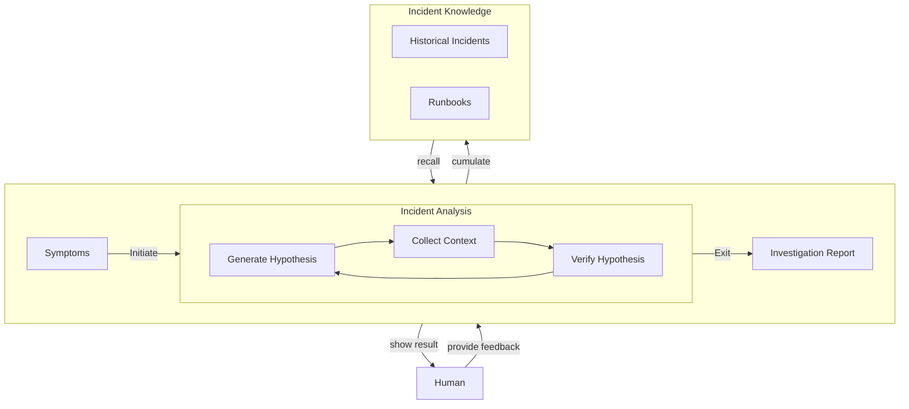
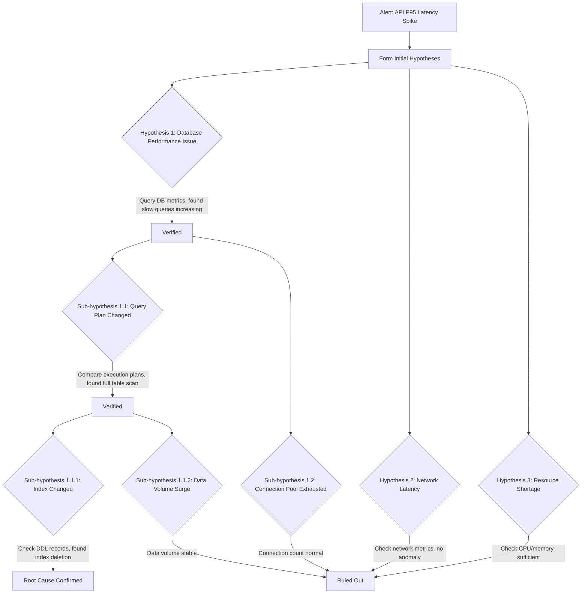

::callout{icon="i-lucide-info" color="info"}
This article introduces the core design philosophy of Castrel's incident troubleshooting Agent, including: **hypothesis-driven investigation**, **human-AI collaboration**, and **business knowledge accumulation**, helping teams achieve an efficient closed-loop from "problem discovery" to "root cause identification or quick escalation."
::
---

The diagram below shows the core workflow of Castrel's incident troubleshooting Agent




---

## 1. Observability Context


The effectiveness of AI troubleshooting largely depends on the context data it can access. A complete observability context should include the following dimensions:

### Three Core Observability Data Types

| Data Type | Purpose | Typical Sources |
| :--- | :--- | :--- |
| **Metrics** | Detect anomalies, quantify problem severity | Prometheus, Zabbix, CloudWatch |
| **Logs** | Locate specific errors, obtain contextual details | Elasticsearch, Loki, Splunk |
| **Traces** | Track request paths, locate slow calls | Jaeger, Tempo, SkyWalking |

Relying solely on any single data type makes efficient troubleshooting difficult. Metrics tell you "something is wrong," Logs tell you "what specific error occurred," and Traces tell you "where in the chain the problem happened."

### Call Relationships and Deployment Relationships

Besides the three observability data types, AI also needs to understand the system's **topology**:

- **Call Relationships**: Dependencies between services (typically provided by APM)
- **Deployment Relationships**: Which hosts/containers services run on (can come from APM, Zabbix, or Kubernetes)

With call relationships, AI can determine whether a fault propagated from upstream or is the current service's own problem; with deployment relationships, AI can correlate infrastructure-level anomalies (such as host CPU spikes, disk full).

### Practical Recommendations

- **Prioritize APM Integration**: APM typically provides Traces, call relationships, and deployment relationships simultaneously, making it the most cost-effective data source
- **Supplement with Infrastructure Monitoring**: Host-level metrics from Zabbix, Node Exporter, etc. are important supplements
- **Kubernetes Metadata**: If using K8s, its Events, Pod status, and Deployment records are all key context

::callout{icon="i-lucide-trophy" color="primary"}
The more complete the data, the more accurate AI's analysis. Missing any data type significantly reduces troubleshooting efficiency.
::

---

## 2. Hypothesis-Driven

### Core Philosophy: Think Like a Human SRE

The traditional AI analysis approach is to collect large amounts of telemetry data, then have the model summarize it all at once. This "summary engine" mode has obvious limitations: as data volume increases, the model is easily distracted by irrelevant signals, and output quality actually decreases.

A more efficient approach is to have AI **think like a human SRE**:

1. **Form Hypotheses**: Based on alerts and preliminary data, generate possible root cause hypotheses
2. **Verify Hypotheses**: For each hypothesis, query specific telemetry data for verification
3. **Recurse Deeper**: When a hypothesis is verified, continue generating deeper sub-hypotheses
4. **Prune Branches**: When a hypothesis is disproven, prune that branch and focus on other directions

### Hypothesis Branching Strategy



### Comparison with Traditional Methods

| Dimension | Traditional Summary Mode | Hypothesis-Driven Mode |
| :--- | :--- | :--- |
| **Data Processing** | Collect all data at once | Query specific data on demand |
| **Noise Interference** | Easily distracted by irrelevant anomalies | Focus on causal relationships |
| **Investigation Depth** | Stays at surface symptoms | Recursively drills down to root cause |
| **Explainability** | Conclusions hard to trace | Complete hypothesis verification chain |

::callout{icon="i-lucide-trophy" color="primary"}
The hypothesis-driven investigation approach makes AI's analysis process transparent and traceable, with data supporting every conclusion.
::

---

## 3. Human-AI Collaboration

The hypothesis-driven investigation approach requires bidirectional human-AI collaboration to maximize effectiveness. Traditional AI analysis is one-way: AI gives conclusions, users accept or reject. A more efficient model is **bidirectional collaboration**:

### AI's Role

- **Master General Knowledge**: Understand system architecture, failure patterns, troubleshooting methodologies
- **Rapidly Scan Data**: Quickly locate anomalies in massive Metrics, Logs, and Traces
- **Parallel Hypothesis Verification**: Simultaneously test multiple possible root cause directions

### Human's Role

- **Business Context**: Inform AI about business logic, such as "CPU being high at 9 PM is because of a marketing campaign, which is normal"
- **Experience Input**: Provide historical experience, such as "Our network is unstable; last time it was DNS Server jitter"

### Typical Collaboration Scenario

```
AI:   (Completed preliminary hypothesis analysis)
      "Verified 3 hypotheses:
       ✓ Database slow queries increasing - matches alert timing
       ✗ Network latency - no anomaly
       ✗ Resource shortage - CPU/memory sufficient

       Continuing deep investigation in database direction..."

User: (Sees hypothesis list, recalls last week's change)
      "DBA modified the order table index last week"

AI:   (Adds new hypothesis and verifies)
      "New hypothesis: Index change caused query plan change
       → Check DDL change records: Found order table index deleted last Thursday
       → Compare query plans: Used index scan before deletion, changed to full table scan after
       → Time correlation: Index deletion time matches slow query start time
       ✓ Hypothesis verified, confirmed as root cause"

User: (Verification successful)
      "Confirmed! Need to restore the index."
```

::callout{icon="i-lucide-trophy" color="primary"}
AI excels at processing massive data and general knowledge; humans excel at providing business context and historical experience. Bidirectional collaboration makes troubleshooting efficiency far exceed pure AI or pure human efforts.
::

---

## 4. Exit Strategies

AI doesn't always directly find the root cause—especially when data integration is incomplete. But that doesn't mean AI's analysis has no value.

### Deep Investigation of Multi-Component Issues

In complex incidents, the root cause may span multiple systems or require multiple steps to find. The hypothesis-driven approach allows AI to recursively investigate deeper until the search space is exhausted.

**Case: Pod Frequently Restarting (CrashLoopBackOff)**

```
Alert: Kubernetes Pod enters CrashLoopBackOff state

First Layer Analysis:
  → Hypothesis: Memory shortage causing OOM Kill
  → Verification: Check Pod events, confirmed OOMKilled
  → Conclusion: Verified, but this is only the surface cause

Second Layer Analysis (Recursive Deep Dive):
  → Hypothesis: Abnormally large request load causing memory spike
  → Verification: Check inbound traffic, found Kafka message size abnormal
  → Conclusion: Verified, continue deeper

Third Layer Analysis:
  → Hypothesis: Upstream system sending abnormally large messages
  → Verification: Check message source, found certain batch data contains corrupted large files
  → Conclusion: Root cause confirmed - upstream data anomaly causing message size overflow
```

Earlier versions of AI might stop at the first layer, giving a "Pod OOM" conclusion. But this provides limited help to engineers—they already know this from the alert. What's truly valuable is finding **why it's OOMing**.

### The Value of Ruling Out Distractions

Even if AI lacks sufficient data to directly locate the root cause, it can often:

1. **Point to the general investigation direction**: For example, "the problem is most likely in the database layer" or "related to recent deployment changes"
2. **Rule out irrelevant distractions**: For example, confirm network connectivity is normal, resource utilization is sufficient, cache hit rate has no anomalies

This "elimination method" itself saves users significant time. In traditional troubleshooting, engineers often need to check network, resources, cache, and other infrastructure one by one before ruling out these possibilities. AI can complete these checks in minutes, letting users focus directly on the truly probable problem directions.

### Context Handoff

When AI cannot continue deeper due to insufficient data, it can provide structured context handoff for users:

```
📋 Investigation Progress Handoff

⏱️ Analysis Time: 5 minutes | Components Scanned: 12

✅ Ruled Out:
• Network connectivity normal (Ping <1ms, no packet loss)
• K8s resources sufficient (CPU <60%, Memory <70%)
• Cache hit rate normal (Redis 99.2%)

🎯 General Direction:
• Problem concentrated on order-service → mysql-cluster link
• Probability of database performance-related issues is high

⚠️ Needs Manual Confirmation (Missing Data Sources):
• Database slow query logs (not integrated)
• Recent Schema change records (not integrated)
```

::callout{icon="i-lucide-trophy" color="primary"}
Early scanning results aren't wasted. Even if AI cannot give the final answer, users can start from a smaller investigation scope rather than from scratch.
::

---

## 5. Knowledge Accumulation


Without SOPs or Runbooks, AI may need to do extensive exploration when first encountering certain types of problems. But these exploration results shouldn't be wasted.

### The Complexity of Causal Verification

The core of the hypothesis-driven investigation approach is **verifying causal relationships**—determining whether a certain anomaly actually caused the current alert. However, causal verification is far more complex than it appears:

| Verification Dimension | Description | Challenge |
| :--- | :--- | :--- |
| **Time Correlation** | Whether anomaly occurrence time matches alert time | Timestamps may have skew in distributed systems |
| **Propagation Path** | Whether the anomaly is on the upstream/downstream link of the alert | Requires complete call topology map |
| **Impact Scope** | Whether resources affected by anomaly are related to the alert | Requires understanding dependencies between resources |
| **Business Semantics** | Whether the anomaly makes sense at the business level | Requires deep understanding of business logic |

The last item, "Business Semantics," especially relies on **deep understanding of customer business**. For example:

- Order service latency increases, AI finds slow queries in the database. But is this slow query a scheduled report task (runs daily at midnight, unrelated to business), or a core order query? Only someone who understands the business can judge.
- A service's error rate increases, AI finds a recent code deployment. But is this deployment a new feature canary (expected to have some errors), or an unexpected bug? Understanding the release plan is needed to judge.

This business knowledge cannot be directly obtained from telemetry data; it must be accumulated through knowledge accumulation.

### Accumulating Knowledge from Troubleshooting Processes

When an incident investigation is completed, AI can summarize the troubleshooting process into knowledge entries:

- **Problem Characteristics**: What combination of alerts/symptoms triggered this investigation
- **Investigation Path**: What directions were tried, what root cause was ultimately located
- **Solution**: How to fix it, what precautions to note

### Binding to Specific Alerts and Resources

This knowledge can be bound to specific alert types or resources. When a similar problem is encountered next time:

1. AI automatically retrieves relevant knowledge
2. Refers to the previous investigation approach to quickly confirm if it's the same problem
3. If symptoms match, directly provide fix recommendations; if not, at least rule out this direction

### Example Scenario

```
First Time:
• Alert: order-service P95 latency increase
• Investigation Process: Check network → Check resources → Check database → Found index issue
• Accumulated Knowledge: Bound to order-service + latency-type alerts

Second Time:
• Same alert triggers
• AI automatically correlates knowledge: "Last time a similar problem was caused by an index, should we prioritize checking the database?"
• After user confirms, directly jump to database check, skip network and resource investigation
• Investigation time reduced from 30 minutes to 5 minutes
```

::callout{icon="i-lucide-trophy" color="primary"}
The accuracy of causal verification depends on deep understanding of the business. Through knowledge accumulation, the team's business experience no longer exists only in individuals' minds but becomes an important basis for AI's causal relationship judgment.
::

---

## 6. Summary

| Capability | Description |
| :--- | :--- |
| **Observability Context** | Integrating Metrics, Logs, Traces, and call topology |
| **Hypothesis-Driven** | Form hypothesis → Verify → Recursively drill down, rather than simple summarization |
| **Human-AI Collaboration** | AI scans data, humans provide business context and historical experience |
| **Exit Strategies** | Even if root cause cannot be located, can rule out distractions and output key findings |
| **Knowledge Accumulation** | Accumulate business knowledge to improve subsequent troubleshooting accuracy and efficiency |

The goal of Castrel's incident troubleshooting Agent is not "AI replacing humans," but making human-AI collaboration efficiency far exceed pure AI or pure human efforts.
