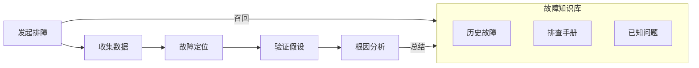
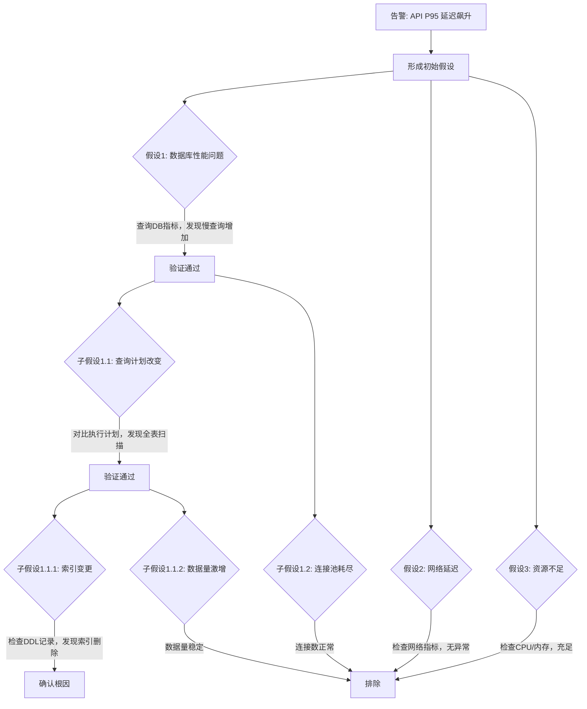

# Castrel 如何构建故障诊断 Agent

::callout{icon="i-lucide-info" color="info"}
**摘要：** 本文介绍 Castrel 故障诊断 Agent 的核心设计理念，包括：**假设驱动的调查方法**、**人机双向协作**、**业务知识沉淀**，帮助团队实现从"发现问题"到"根因定位或快速逃逸"的高效闭环。
::
---

下图展示了 Castrel 故障诊断 Agent 的核心工作流程




---

## 一、快速确认

### 核心理念

故障响应的第一步是**确认问题确实存在**，而不是在误报上浪费时间。AI 可以在告警触发的第一时间进行初步分析，帮助用户快速判断这是真实故障还是误报，并在确认后立即启动深度排查。

### 关键设计点

| 设计要素 | 说明 |
| :--- | :--- |
| **即时分析** | 告警触发后，AI 自动进行初步分析，给出告警是否需要关注的判断依据 |
| **快速确认** | 用户基于 AI 的初步分析，快速决定是否将此告警升级为故障进行排查 |
| **一键启动** | 确认后一键启动深度排查，无需手动打开多个系统查看数据 |

### 实践建议

- **区分告警与故障**：不是所有告警都需要深度排查，AI 的初步分析帮助用户做出判断
- **降低确认门槛**：通过 Slack 等 IM 工具推送分析结果，用户无需登录控制台即可确认
- **避免自动化过度**：深度排查会消耗大量资源，需要用户明确授权后才启动

::callout{icon="i-lucide-trophy" color="primary"}
让用户在几秒钟内判断是否需要介入，而不是花几分钟打开各种监控系统。
::

---

## 二、可观测上下文


AI 排障的效果很大程度上取决于它能获取到的上下文数据。一个完整的可观测性上下文应包含以下几个维度：

### 三种核心可观测数据

| 数据类型 | 作用 | 典型来源 |
| :--- | :--- | :--- |
| **Metrics（指标）** | 发现异常、量化问题严重程度 | Prometheus、Zabbix、CloudWatch |
| **Logs（日志）** | 定位具体错误、获取上下文细节 | Elasticsearch、Loki、Splunk |
| **Traces（链路）** | 追踪请求路径、定位慢调用 | Jaeger、Tempo、SkyWalking |

单独依赖任何一种数据都难以完成高效排障。Metrics 告诉你"出了问题"，Logs 告诉你"具体什么错误"，Traces 告诉你"问题发生在哪个环节"。

### 调用关系与部署关系

除了三种可观测数据，AI 还需要理解系统的**拓扑结构**：

- **调用关系**：服务之间的依赖关系（通常由 APM 提供）
- **部署关系**：服务运行在哪些主机/容器上（可来自 APM、Zabbix 或 Kubernetes）

有了调用关系，AI 才能判断故障是从上游传播下来，还是当前服务自身的问题；有了部署关系，AI 才能关联基础设施层面的异常（如宿主机 CPU 飙高、磁盘满）。

### 实践建议

- **优先接入 APM**：APM 通常同时提供 Traces、调用关系和部署关系，是性价比最高的数据源
- **补充基础设施监控**：Zabbix、Node Exporter 等提供的主机层指标是重要补充
- **Kubernetes 元数据**：如果使用 K8s，其 Events、Pod 状态、Deployment 记录都是关键上下文

::callout{icon="i-lucide-trophy" color="primary"}
数据越完整，AI 的分析越准确。缺少任何一种数据都会让排障效率大打折扣。
::

---

## 三、假设驱动

### 核心理念：像人类 SRE 一样思考

传统的 AI 分析方式是收集大量遥测数据，然后让模型一次性总结。这种"摘要引擎"模式有明显的局限性：随着数据量增加，模型容易被无关信号干扰，输出质量反而下降。

更高效的方式是让 AI **像人类 SRE 一样思考**：

1. **形成假设**：基于告警和初步数据，生成可能的根因假设
2. **验证假设**：针对每个假设，查询特定的遥测数据进行验证
3. **递归深入**：当假设被验证后，继续生成更深层次的子假设
4. **排除分支**：当假设被否定后，修剪该分支，聚焦其他方向

### 假设分支策略



### 与传统方法的对比

| 维度 | 传统摘要模式 | 假设驱动模式 |
| :--- | :--- | :--- |
| **数据处理** | 一次性收集所有数据 | 按需查询特定数据 |
| **噪音干扰** | 容易被无关异常干扰 | 聚焦因果关系 |
| **调查深度** | 停留在表面症状 | 递归深入到根因 |
| **可解释性** | 结论难以追溯 | 完整的假设验证链路 |

::callout{icon="i-lucide-trophy" color="primary"}
假设驱动的调查方法让 AI 的分析过程透明可追溯，每一步结论都有对应的数据支撑。
::

---

## 四、人机协作


假设驱动的调查方法需要人机双向协作才能发挥最大效果。传统 AI 分析是单向的：AI 给出结论，用户接受或拒绝。更高效的模式是**双向协作**：

### AI 的作用

- **掌握通用知识**：理解系统架构、故障模式、排查方法论
- **快速扫描数据**：在海量 Metrics、Logs、Traces 中快速定位异常
- **并行验证假设**：同时检验多个可能的根因方向

### 人的作用

- **业务上下文**：告知 AI 业务逻辑，如"晚上 9 点 CPU 高是因为有运营活动，属于正常现象"
- **经验输入**：提供历史经验，如"我们这的网络不太稳定，上次就是 DNS Server 有抖动"

### 典型协作场景

```
AI：  （完成初步假设分析）
      "已验证 3 个假设：
       ✓ 数据库慢查询增加 - 与告警时间吻合
       ✗ 网络延迟 - 无异常
       ✗ 资源不足 - CPU/内存充足

       正在深入调查数据库方向..."

用户：（看到假设列表，想起上周的变更）
      "上周 DBA 改过 order 表的索引"

AI：  （新增假设并验证）
      "新假设：索引变更导致查询计划改变
       → 检查 DDL 变更记录：发现 order 表索引于上周四被删除
       → 对比查询计划：删除前使用索引扫描，删除后变为全表扫描
       → 时间关联：索引删除时间与慢查询开始时间吻合
       ✓ 假设验证通过，确认为根因"

用户：（验证成功）
      "确认！需要恢复索引。"
```

::callout{icon="i-lucide-trophy" color="primary"}
AI 擅长处理海量数据和通用知识，人擅长提供业务上下文和历史经验。双向协作让排障效率远超纯 AI 或纯人工。
::

---

## 五、缩小范围

AI 并不总是能直接找到故障根因——尤其是在数据集成不完整的情况下。但这并不意味着 AI 的分析没有价值。

### 多组件问题的深度调查

在复杂故障中，根因可能跨越多个系统或需要多个步骤才能找到。假设驱动的方法允许 AI 递归地深入调查，直到穷尽搜索空间。

**案例：Pod 频繁重启（CrashLoopBackOff）**

```
告警: Kubernetes Pod 进入 CrashLoopBackOff 状态

第一层分析:
  → 假设: 内存不足导致 OOM Kill
  → 验证: 检查 Pod 事件，确认 OOMKilled
  → 结论: 验证通过，但这只是表面原因

第二层分析（递归深入）:
  → 假设: 异常大的请求负载导致内存飙升
  → 验证: 检查入站流量，发现 Kafka 消息体积异常
  → 结论: 验证通过，继续深入

第三层分析:
  → 假设: 上游系统发送了异常大的消息
  → 验证: 检查消息来源，发现某批次数据包含损坏的大文件
  → 结论: 确认根因 - 上游数据异常导致消息体积超限
```

早期版本的 AI 可能在第一层就停止，给出"Pod OOM"的结论。但这对工程师来说帮助有限——他们已经从告警中知道这一点了。真正有价值的是找到 **为什么会 OOM**。

### 排除干扰项的价值

即使 AI 缺少充足的数据直接定位根因，它往往可以：

1. **指出大体的排查方向**：例如"问题大概率在数据库层"或"与最近的部署变更相关"
2. **排除无关的干扰项**：例如确认网络连通性正常、资源使用率充足、缓存命中率无异常

这些"排除法"本身就为用户节约了大量时间。传统排障中，工程师往往需要逐一检查网络、资源、缓存等基础设施，才能排除这些可能性。AI 可以在几分钟内完成这些检查，让用户直接聚焦于真正可能的问题方向。

### 上下文交接

当 AI 因数据不足而无法继续深入时，可以为用户提供结构化的上下文交接：

```
📋 排查进展交接

⏱️ 分析时间：5 分钟 | 扫描组件：12 个

✅ 已排除：
• 网络连通性正常（Ping <1ms，无丢包）
• K8s 资源充足（CPU <60%，内存 <70%）
• 缓存命中率正常（Redis 99.2%）

🎯 大体方向：
• 问题集中在 order-service → mysql-cluster 链路
• 与数据库性能相关的可能性较高

⚠️ 待人工确认（缺少数据源）：
• 数据库慢查询日志（未接入）
• 近期 Schema 变更记录（未接入）
```

::callout{icon="i-lucide-trophy" color="primary"}
前期扫描成果不白费。即使 AI 无法给出最终答案，用户也能从一个更小的排查范围开始，而非从零开始。
::

---

## 六、知识沉淀


在没有 SOP 或 Runbook 的情况下，AI 在首次遇到某类问题时可能需要做大量的探索。但这些探索成果不应该被浪费。

### 因果验证的复杂性

假设驱动的调查方法核心在于**验证因果关系**——判断某个异常是否真的导致了当前告警。然而，因果验证远比表面看起来复杂：

| 验证维度 | 说明 | 挑战 |
| :--- | :--- | :--- |
| **时间关联** | 异常发生时间是否与告警时间吻合 | 分布式系统中时间戳可能有偏差 |
| **传播路径** | 异常是否在告警的上下游链路上 | 需要完整的调用拓扑图 |
| **影响范围** | 异常影响的资源是否与告警相关 | 需要理解资源间的依赖关系 |
| **业务语义** | 异常在业务层面是否有意义 | 需要深度理解业务逻辑 |

最后一项"业务语义"尤其依赖**对客户业务的深度理解**。例如：

- 订单服务延迟上升，AI 发现数据库有慢查询。但这个慢查询是定时报表任务（每天凌晨执行，与业务无关），还是核心订单查询？只有了解业务的人才能判断。
- 某服务错误率上升，AI 发现最近有代码部署。但这次部署是新功能灰度（预期会有少量错误），还是意外的 Bug？需要了解发布计划才能判断。

这种业务知识无法从遥测数据中直接获取，必须通过知识沉淀的方式积累。

### 从排障过程中沉淀知识

当一次故障排查完成后，可以让 AI 将排查过程总结成知识条目：

- **问题特征**：什么样的告警/症状组合触发了这次排查
- **排查路径**：尝试了哪些方向，最终定位到什么根因
- **解决方案**：如何修复，有哪些注意事项

### 绑定到特定告警和资源

这些知识可以绑定到特定的告警类型或资源上。当下一次遇到类似问题时：

1. AI 自动检索相关知识
2. 参照之前的排查思路，快速确认是否是相同问题
3. 如果症状匹配，直接给出修复建议；如果不匹配，至少可以排除这个方向

### 示例场景

```
第一次：
• 告警：order-service P95 延迟上升
• 排查过程：检查网络 → 检查资源 → 检查数据库 → 发现索引问题
• 沉淀知识：绑定到 order-service + 延迟类告警

第二次：
• 同样的告警触发
• AI 自动关联知识："上次类似问题是索引导致的，是否优先检查数据库？"
• 用户确认后，直接跳到数据库检查，跳过网络和资源排查
• 排查时间从 30 分钟缩短到 5 分钟
```

::callout{icon="i-lucide-trophy" color="primary"}
因果验证的准确性依赖于对业务的深度理解。通过知识沉淀，团队的业务经验不再只存在于个人脑中，而是成为 AI 判断因果关系的重要依据。
::

---

## 七、总结

| 能力 | 说明 |
| :--- | :--- |
| **快速确认** | 告警触发后即时分析，区分误报与真实故障 |
| **可观测上下文** | 整合 Metrics、Logs、Traces 及调用拓扑 |
| **假设驱动** | 形成假设 → 验证 → 递归深入，而非简单摘要 |
| **人机协作** | AI 扫描数据，人提供业务上下文和历史经验 |
| **缩小范围** | 即使无法定位根因，也能排除干扰、输出关键发现 |
| **知识沉淀** | 积累业务知识，提升后续排障的准确性和效率 |

Castrel 故障诊断 Agent 的目标不是"AI 替代人"，而是让人机协作的效率远超纯 AI 或纯人工。
