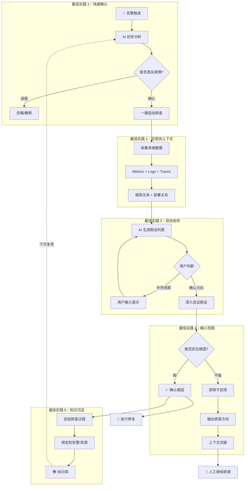
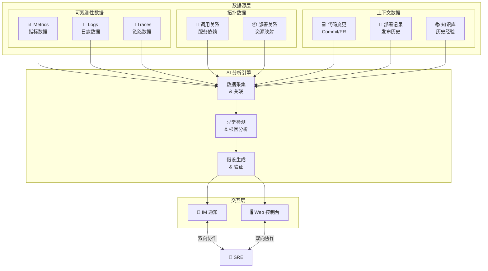

# 从告警到根因：AI 时代的故障排障最佳实践

::callout{icon="i-lucide-info" color="info"}
**摘要：** 在传统的故障排障流程中，SRE 工程师往往需要手动查看 Grafana 面板、翻阅日志、检查部署记录——这一系列操作既耗时又依赖个人经验。本文将介绍一套基于 AI 的故障排障最佳实践，帮助团队实现从"发现问题"到"根因定位或快速逃逸"的高效闭环。
::

---

## 一、传统排障的三大痛点


在没有智能化工具支撑的团队中，故障排障通常面临以下挑战：

1. **响应门槛高**：手动查看 Grafana 面板，移动端看图表体验极差，非工作时间响应需要打开电脑连 VPN
2. **依赖个人经验**：故障处理全靠个人经验，缺乏标准化的排查框架，新人难以快速上手
3. **需要多人协作**：根因排查往往涉及多服务、多组件，需要拉上 DBA、网络工程师、业务开发等多人会诊，沟通成本高

> 周四晚上 8:45，你正在客厅看电影，手机震动弹出告警通知：API 网关 P95 延迟飙升至 2.5s。传统做法是连 VPN、打开电脑、排查问题。有没有更好的方式？

---

## 二、最佳实践 1：快速确认故障，立即启动排查

### 核心理念

故障响应的第一步是**确认问题确实存在**，而不是在误报上浪费时间。AI 可以在告警触发的第一时间进行初步分析，帮助用户快速判断这是真实故障还是误报，并在确认后立即启动深度排查。

### 关键设计点

| 设计要素 | 说明 |
| :--- | :--- |
| **即时分析** | 告警触发后，AI 自动进行初步分析，给出告警是否需要关注的判断依据 |
| **快速确认** | 用户基于 AI 的初步分析，快速决定是否将此告警升级为故障进行排查 |
| **一键启动** | 确认后一键启动深度排查，无需手动打开多个系统查看数据 |

### 实践建议

- **区分告警与故障**：不是所有告警都需要深度排查，AI 的初步分析帮助用户做出判断
- **降低确认门槛**：通过 Slack 等 IM 工具推送分析结果，用户无需登录控制台即可确认
- **避免自动化过度**：深度排查会消耗大量资源，需要用户明确授权后才启动

---

## 三、最佳实践 2：完整的可观测上下文


AI 排障的效果很大程度上取决于它能获取到的上下文数据。一个完整的可观测性上下文应包含以下几个维度：

### 三种核心可观测数据

| 数据类型 | 作用 | 典型来源 |
| :--- | :--- | :--- |
| **Metrics（指标）** | 发现异常、量化问题严重程度 | Prometheus、Zabbix、CloudWatch |
| **Logs（日志）** | 定位具体错误、获取上下文细节 | Elasticsearch、Loki、Splunk |
| **Traces（链路）** | 追踪请求路径、定位慢调用 | Jaeger、Tempo、SkyWalking |

单独依赖任何一种数据都难以完成高效排障。Metrics 告诉你"出了问题"，Logs 告诉你"具体什么错误"，Traces 告诉你"问题发生在哪个环节"。

### 调用关系与部署关系

除了三种可观测数据，AI 还需要理解系统的**拓扑结构**：

- **调用关系**：服务之间的依赖关系（通常由 APM 提供）
- **部署关系**：服务运行在哪些主机/容器上（可来自 APM、Zabbix 或 Kubernetes）

有了调用关系，AI 才能判断故障是从上游传播下来，还是当前服务自身的问题；有了部署关系，AI 才能关联基础设施层面的异常（如宿主机 CPU 飙高、磁盘满）。

### 实践建议

- **优先接入 APM**：APM 通常同时提供 Traces、调用关系和部署关系，是性价比最高的数据源
- **补充基础设施监控**：Zabbix、Node Exporter 等提供的主机层指标是重要补充
- **Kubernetes 元数据**：如果使用 K8s，其 Events、Pod 状态、Deployment 记录都是关键上下文

---

## 四、最佳实践 3：双向协作，而非单向输出


传统 AI 分析是单向的：AI 给出结论，用户接受或拒绝。更高效的模式是**双向协作**：

### AI → 人

- 提供假设、证据、传播拓扑
- 生成可视化图表和摘要
- 关联历史 Runbook 和修复建议

### 人 → AI

- 💬 **输入提示**：用户输入自然语言，AI 解析意图，聚焦特定范围重新扫描
- ➕ **添加假设**：用户点击添加按钮，AI 针对新假设收集相关证据

### 典型协作场景

```
用户：（看到 AI 的假设列表，想起上周的变更）
      "上周 DBA 改过 order 表的索引，检查一下是否有关"

AI：  （聚焦 order 表相关变更进行扫描）
      "发现 order 表索引变更导致查询计划改变，附带索引变更 diff 和查询性能对比图"

用户：（验证成功）
      "果然！索引改了之后全表扫描变多了。"
```

::note
发挥人类对业务上下文的理解（"上周 DBA 改过索引"），弥补 AI 对隐性知识的不足。
::

---

## 五、最佳实践 4：即使无法定位根因，也能缩小排查范围

AI 并不总是能直接找到故障根因——尤其是在数据集成不完整的情况下。但这并不意味着 AI 的分析没有价值。

### 排除干扰项的价值

即使 AI 缺少充足的数据直接定位根因，它往往可以：

1. **指出大体的排查方向**：例如"问题大概率在数据库层"或"与最近的部署变更相关"
2. **排除无关的干扰项**：例如确认网络连通性正常、资源使用率充足、缓存命中率无异常

这些"排除法"本身就为用户节约了大量时间。传统排障中，工程师往往需要逐一检查网络、资源、缓存等基础设施，才能排除这些可能性。AI 可以在几分钟内完成这些检查，让用户直接聚焦于真正可能的问题方向。

### 上下文交接

当 AI 因数据不足而无法继续深入时，可以为用户提供结构化的上下文交接：

```
📋 排查进展交接

⏱️ 分析时间：5 分钟 | 扫描组件：12 个

✅ 已排除：
• 网络连通性正常（Ping <1ms，无丢包）
• K8s 资源充足（CPU <60%，内存 <70%）
• 缓存命中率正常（Redis 99.2%）

🎯 大体方向：
• 问题集中在 order-service → mysql-cluster 链路
• 与数据库性能相关的可能性较高

⚠️ 待人工确认（缺少数据源）：
• 数据库慢查询日志（未接入）
• 近期 Schema 变更记录（未接入）
```

::callout{icon="i-lucide-trophy" color="primary"}
前期扫描成果不白费。即使 AI 无法给出最终答案，用户也能从一个更小的排查范围开始，而非从零开始。
::--

## 六、最佳实践 5：知识沉淀，让经验可复用


在没有 SOP 或 Runbook 的情况下，AI 在首次遇到某类问题时可能需要做大量的探索。但这些探索成果不应该被浪费。

### 从排障过程中沉淀知识

当一次故障排查完成后，可以让 AI 将排查过程总结成知识条目：

- **问题特征**：什么样的告警/症状组合触发了这次排查
- **排查路径**：尝试了哪些方向，最终定位到什么根因
- **解决方案**：如何修复，有哪些注意事项

### 绑定到特定告警和资源

这些知识可以绑定到特定的告警类型或资源上。当下一次遇到类似问题时：

1. AI 自动检索相关知识
2. 参照之前的排查思路，快速确认是否是相同问题
3. 如果症状匹配，直接给出修复建议；如果不匹配，至少可以排除这个方向

### 示例场景

```
第一次：
• 告警：order-service P95 延迟上升
• 排查过程：检查网络 → 检查资源 → 检查数据库 → 发现索引问题
• 沉淀知识：绑定到 order-service + 延迟类告警

第二次：
• 同样的告警触发
• AI 自动关联知识："上次类似问题是索引导致的，是否优先检查数据库？"
• 用户确认后，直接跳到数据库检查，跳过网络和资源排查
• 排查时间从 30 分钟缩短到 5 分钟
```

::callout{icon="i-lucide-trophy" color="primary"}
团队的排障经验不再只存在于个人脑中，而是沉淀为可复用的组织知识。新人也能借助这些知识快速上手。
::

---

## 七、总结：构建你的排障工作流


| 阶段 | 最佳实践 | 核心价值 |
| :--- | :--- | :--- |
| **告警** | 快速确认故障，一键启动 | 区分误报与真实故障，降低响应门槛 |
| **AI分析** | 完整的可观测上下文 | Metrics + Logs + Traces + 拓扑关系 |
| **人机协作** | 双向人机交互 | 发挥人类经验 + AI 扫描能力 |
| **问题定位** | 缩小范围，排除干扰 | 目标不是定位根因，而是缩小排查范围，提供尽可能有价值的信息 |
| **知识沉淀** | 知识绑定告警和资源 | 让排障经验可复用，提高 Agent 排障稳定性，降低 AI 成本 |

故障排障的目标不是"AI 替代人"，而是"人机配合，比纯靠 AI 或纯手动都快"。通过合理的流程设计和工具支撑，团队可以显著提升故障响应效率，降低 MTTR（平均修复时间）。

### 排障流程图

下图展示了 Castrel 辅助排障的完整流程，以及各最佳实践在流程中的位置：



### 系统架构图

下图展示了 Castrel 排障系统所需的数据源和组件关系：


