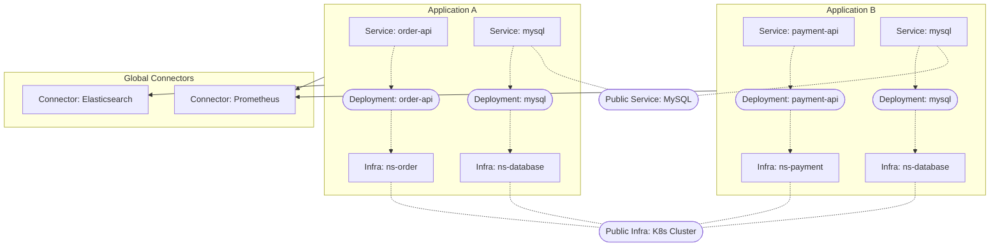

# Applications

Applications are the foundational namespace unit in Castrel for organizing and isolating operational context. If you have multiple unrelated business systems within the same Castrel tenant, Applications allow you to keep them logically separated.

## What is an Application?

An Application is a container that groups related operational resources together:

- **Services** — The microservices, APIs, and components that make up your system
- **Infrastructures** — Infrastructure like servers, databases, and cloud resources
- **Knowledges** — Operational documentation, runbooks, and context specific to this application

## Architecture Overview

## Core Concepts

### Services and Infrastructures

Both Services and Infrastructures belong to an Application. They are connected through **Service Instances**:

- A **Service** is instantiated into a **Service Instance**
- A **Service Instance** is deployed on an **Infrastructure**

This model captures the relationship between what your application does (Services) and where it runs (Infrastructures).

### Public Services and Public Infrastructures

In real-world scenarios, multiple Applications often share common components:

- **Public Service**: A shared service definition like MySQL or Redis. When Application A and Application B both use MySQL, each Application maintains its own `mysql` Service entry, but both reference the same Public Service definition. This allows each team to maintain application-specific knowledge while sharing common documentation.

- **Public Infrastructure**: Shared infrastructure like a Kubernetes cluster or a database server. Each Application maintains its own Infrastructure entries (e.g., specific pods or VMs) that reference the common Public Infrastructure. This preserves the application-level relationship and context.

::callout{icon="i-lucide-info" color="info"}
Even when referencing public resources, each Application maintains its own copy of Service/Infrastructure entries. This ensures proper context isolation while allowing shared knowledge to propagate.
::

### Connectors (Global)

Connectors are **global resources** that represent data sources like Prometheus, Elasticsearch, or Grafana Loki. They are not scoped to any specific Application.

Applications record which Connectors contain their observability data. This linkage tells Castrel: *"When investigating this Application, query these Connectors for relevant data."*

## Why Use Applications?

### Context Isolation

When investigating incidents or triaging alerts, Castrel uses the Application boundary to scope its analysis:

- Queries only access relevant data sources
- Knowledge retrieval is focused on applicable documentation
- Alert correlation considers only related services

### Multi-Team Support

Different teams can work independently within their own Applications:

- Team A manages their e-commerce platform in `app-ecommerce`
- Team B manages their data pipeline in `app-data-platform`
- Both teams share the same Castrel tenant without interference

## Getting Started

1. Create an Application in the Castrel console
2. Add Services that belong to this application
3. Add Infrastructures where your services run
4. Link the Application to Connectors that contain its observability data
5. Upload or generate Knowledges for operational context

Once configured, Castrel will automatically scope its operations to the appropriate Application context.
