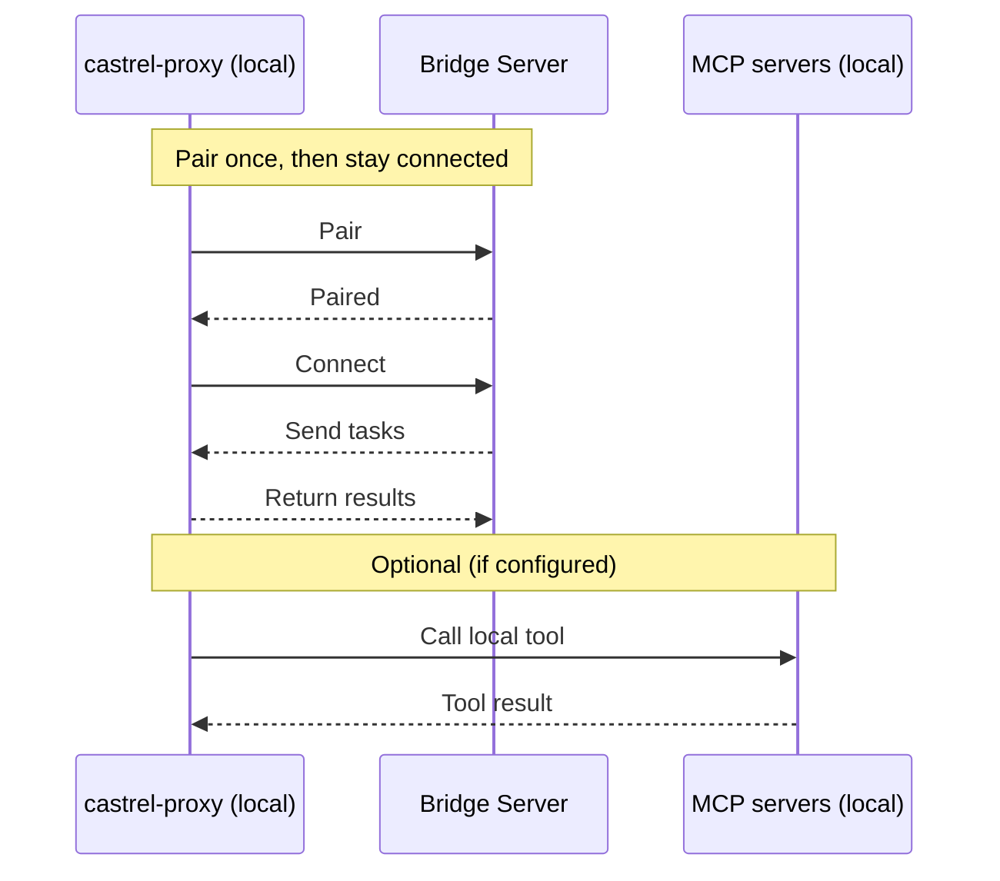

---

## title: Castrel Proxy
description: Connect local diagnostics to Castrel's intelligence.

## What is Castrel Proxy?

Castrel Proxy is a lightweight **local Bridge client**. It connects to a remote Castrel Bridge Server over WebSocket, receives instructions from the server, executes them on your machine, and sends results back.

::callout{icon="i-simple-icons-github" color="gray"}
**Open Source** — Castrel Proxy is fully open source. Browse the code, report issues, or contribute on GitHub: [castrel-ai/castrel-proxy](https://github.com/castrel-ai/castrel-proxy)
::

It provides three core capabilities:

- **Command execution**: run shell commands (strictly controlled by a whitelist)
- **Document operations**: read / write / edit files (with path and size constraints)
- **MCP integration**: connect to locally configured MCP services and sync available tools to the server

## How it works

Castrel Proxy pairs with the server, keeps a persistent connection, executes tasks locally, and returns results. If you configure MCP, it can also call local MCP tools when needed.




## Quick start

### Install

::code-group

```bash [Script]
curl -fsSL https://castrel.ai/castrel-proxy/install.sh | bash
```

```bash [Pip]
pip install castrel-proxy
```

::

Requirement: Python >= 3.10

### Pair

Get a **verification code** and **server URL** from your Castrel / Bridge Server admin UI, then run:

```bash
castrel-proxy pair <verification_code> <server_url>
```

After pairing, Castrel Proxy will:

- Save pairing config to `~/.castrel/config.yaml`
- Initialize command whitelist at `~/.castrel/whitelist.conf`
- Attempt to read `~/.castrel/mcp.json` and sync MCP tool info once (skipped if not configured)

### Start

```bash
# Background daemon mode (default, Unix/macOS only)
castrel-proxy start

# Foreground mode (all platforms)
castrel-proxy start --foreground
```

### Status and logs

```bash
castrel-proxy status
castrel-proxy logs
castrel-proxy logs -f
```

### Stop / unpair

```bash
castrel-proxy stop
castrel-proxy unpair
```

## Configuration and file locations

By default, Castrel Proxy uses `~/.castrel/`:

- **Bridge config**: `~/.castrel/config.yaml`
  - `server_url`: server URL
  - `verification_code`: pairing code
  - `client_id`: stable ID derived from hostname + MAC (16 hex chars)
  - `workspace_id`: extracted from the verification code
  - `paired_at`: pairing timestamp
- **Command whitelist**: `~/.castrel/whitelist.conf`
  - One allowed base command per line (e.g. `git`, `kubectl`)
- **MCP config (optional)**: `~/.castrel/mcp.json`
- **Daemon files** (background mode):
  - PID: `~/.castrel/castrel-proxy.pid`
  - Log: `~/.castrel/castrel-proxy.log`
- **Per-session logs** (written when server sends tasks):
  - `~/.castrel/<session_id>/terminal.log`

## Core capabilities (as implemented)

### 1) Command execution (whitelist enforced)

When the server sends a command, Castrel Proxy executes it locally and returns `stdout`, `stderr`, `exit_code`, and timing.

Security behavior:

- **Whitelist required**: only commands whose base command is present in `~/.castrel/whitelist.conf` can run
- **Compound commands are parsed**: `ls && cat file | grep foo` is split and every subcommand must be allowed
- **Clear rejection errors**: the response includes which commands are blocked and the whitelist file path

### 2) Document operations (read / write / edit)

Castrel Proxy supports:

- Read a file
- Overwrite-write a file
- Edit a file with `replace` / `append` / `prepend`

Constraints:

- **Paths must be absolute**
- **Read size limit is 10MB**
- **Runs with your user permissions** (no privilege escalation)

### 3) MCP (Model Context Protocol) integration

If you want to expose local MCP tools to the server, configure `~/.castrel/mcp.json` and use:

```bash
castrel-proxy mcp-list
castrel-proxy mcp-sync
```

Supported transports (as implemented):

- `stdio` (requires `command` + `args`, optional `env`)
- `http` (requires `url`)
- `sse` (requires `url`)

## When to use Castrel Proxy

- Local troubleshooting: bring local command output and local files into a remote investigation flow
- Controlled remote collaboration: keep execution limited to your approved whitelist
- Bridge local MCP tools: filesystem/github/internal HTTP MCP services, etc.

## FAQ

### Does Castrel Proxy open inbound ports on my machine?

No. It makes an outbound WebSocket connection to the server and does not require inbound ports.

### How do I allow an additional command?

Add the base command name to `~/.castrel/whitelist.conf` (one per line). For example, to allow `kubectl get pods`, add `kubectl`.

### Why did file reading fail?

Common reasons:

- The path is not absolute
- The file is larger than 10MB
- Your user does not have read permission

### How do I uninstall?

Stop the proxy, uninstall, and remove all local configs and logs:

::code-group

```bash [Script]
castrel-proxy stop
rm -f castrel-proxy
rm -rf ~/.castrel
```

```bash [Pip]
castrel-proxy stop
pip uninstall castrel-proxy
rm -rf ~/.castrel
```

::