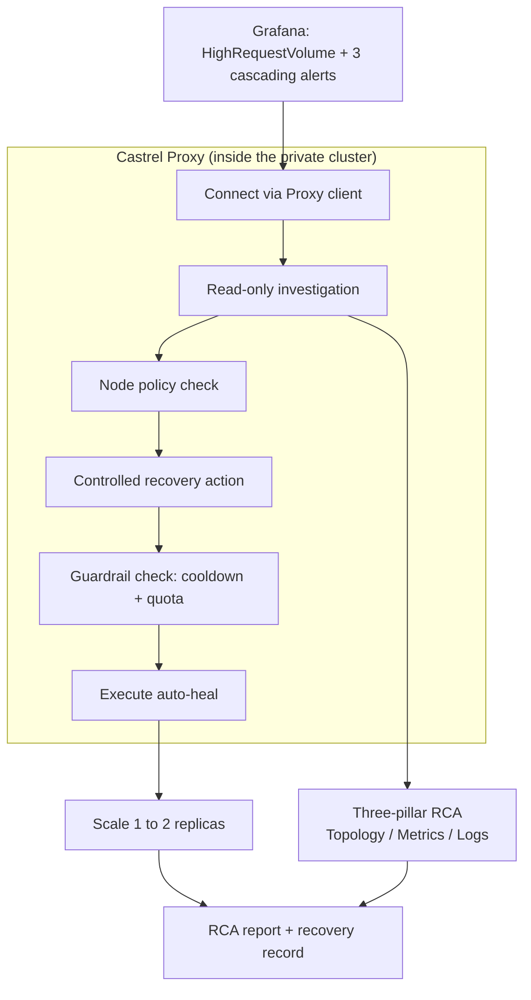

::callout{icon="i-lucide-info" color="info"}
This article follows a typical incident from alert to fix. It shows three capabilities working together: **Castrel Proxy** connecting to a private cluster, **permission management** that decides exactly what the agent may read and which recovery actions it may trigger, and **execution failure recovery** that safely restores a degraded service. The point is not that the agent can run commands. It is that a team can let an agent act inside production without losing control.
::

---

## The Scenario

A food-ordering microservice, `ts-train-food-service`, runs inside a private Kubernetes cluster. There is no public ingress to the cluster, no bastion the agent can log into, and the on-call engineer is asleep.

At 2 AM, Grafana fires a `HighRequestVolume` alert. Seconds later three more alerts follow: elevated latency, memory pressure, and error-rate spikes on adjacent services. Four alerts, one page, and a tired engineer who now has to figure out which one is the real problem and which three are just downstream noise.

This is the moment most incidents actually go wrong. Not because the fix is hard, but because the first thirty minutes are spent reconstructing context: opening dashboards, correlating timestamps, tracing which service failed first, and confirming it is safe to touch anything.

---

## Why the Old Way Is Slow

The manual path has a predictable shape, and every step costs time:

- **Reach the cluster.** The engineer connects through a VPN, finds the right kube-context, and hopes their access still works.
- **Separate cause from effect.** Four alerts look equally urgent. Deciding that three of them are cascading victims of one root cause requires reading metrics, logs, and traces across several services.
- **Confirm it is safe to act.** Before scaling anything, the engineer has to check whether the cluster even has the capacity, or they risk turning one broken service into a broken node.
- **Act, then document.** Only after all of that does the actual fix happen, and the write-up usually happens the next morning, if at all.

An ordinary chatbot cannot help here. It has no route into the private cluster, no live telemetry, and no safe way to run a command. It can suggest what you might do. It cannot do it.

---

## How Castrel Takes Over the Workflow

Castrel treats this as one connected task instead of a pile of separate tools. In this scenario, the flow looks like this.

### 1. Castrel Proxy connects to the private cluster

The cluster has no public entry point, so Castrel does not try to reach in from the outside. Instead, a lightweight **Castrel Proxy** already runs inside the customer network. The agent talks to that proxy, and the proxy runs commands locally against the cluster it lives in.

In practice this means the agent can run `kubectl get`, inspect pod events, and read a file from disk, all executed *inside* the network by the proxy rather than over an exposed port. The private cluster stays private. Nothing about its topology is published to reach it.

The proxy also advertises what it can do: which MCP servers are available (for example a GitLab integration and a reasoning service) and which operational skills are installed, such as `rootcause`, `k8s-troubleshoot`, and `slo-health-check`. The agent picks the skill that matches the alert instead of improvising.

### 2. Permission management decides what the agent may touch

Connecting to the network is not the same as being allowed to do anything on it. The proxy carries a **node policy** that the organization controls. In this scenario, the policy is split into two layers: the investigation phase can read broad context, while the recovery phase can only trigger pre-registered, parameter-constrained recovery actions.

| Capability | Policy |
| :--- | :--- |
| **Read-only inspection commands** | Allowed, but constrained by an allowlist, such as `kubectl get`, pod event inspection, and `cat` |
| **Filesystem read** | Enabled for logs, configuration snippets, and local diagnostic context |
| **Filesystem write / edit** | Not open-ended; authorized only when a specific skill needs to write a recovery record |
| **Recovery actions** | Limited to pre-registered actions, such as scaling one named Deployment from 1 to 2 replicas; arbitrary write commands are not allowed |

This is the part that makes autonomous action acceptable. The team decides in advance what the agent is permitted to run on each node, which recovery actions may be triggered, and which checks must pass before each action. The agent operates inside that boundary rather than asking to be trusted with the whole box. A cluster owner can grant read-everywhere, execute-narrowly, and recover-through-allowlisted-actions, while the agent still gets enough room to investigate and recover.

::callout{icon="i-lucide-shield-check" color="primary"}
The node policy turns "can the agent act in production?" into a controlled question. The answer is scoped, auditable, and set by the people who own the infrastructure, not by the agent.
::

### 3. A three-pillar investigation finds the real root cause

With read access through the proxy, the agent runs a hypothesis-driven investigation across the three observability pillars:

- **Topology (traces):** map the call graph to see which service is the origin and which are downstream.
- **Metrics:** correlate the alert timing with resource usage.
- **Logs:** confirm the specific failure mode.

In this scenario, the finding was clear: `ts-train-food-service` was running a single replica whose memory sat at roughly 91% of its 2Gi limit while absorbing over a thousand requests in five minutes. The other three alerts were cascading victims of that one saturated pod. The alert storm collapses into a single, explainable root cause.

### 4. Execution failure recovery, gated by guardrails

Diagnosis alone would still leave a sleeping engineer with a broken service. So the `rootcause` skill goes one step further and triggers a controlled recovery action through the proxy: horizontally scaling the target Deployment.

Crucially, this is not an arbitrary shell command. It is a pre-registered recovery action that accepts a specific service name, namespace, and replica count, and two guardrails must pass before it acts:

- **Cooldown.** A 180-second cooldown prevents the agent from repeatedly scaling the same service in a tight loop.
- **Quota Guard.** If the cluster has less than 10% allocatable CPU or memory left, scaling is blocked. Adding a replica to a cluster that is already full would only spread the failure.

In this scenario the cluster had about 97% CPU headroom, so the Quota Guard passed. The agent scaled the deployment from 1 to 2 replicas, and the service returned to a healthy state in seconds.

The whole process also leaves a recovery record: alert source, triggered skill, policy check result, guardrail result, executed action, execution time, and final state are written into the report. The next morning's review does not have to reconstruct the answer from chat history or terminal output.

---

## The Result

By the time the on-call engineer would normally have finished connecting to the VPN, the incident was already handled:

- The four-alert storm was reduced to one identified root cause.
- The failing service was scaled from 1 to 2 replicas and recovered.
- A root-cause report and a recovery record were written, so the morning review starts from a finished investigation instead of a blank page.

The engineer wakes up to a resolved incident with a full explanation, not a 2 AM page.

The value is not that one click disappeared. The value is that the full chain from "alert fired" to "root cause confirmed, recovery executed, audit material preserved" became shorter and more repeatable. For the team, that means faster response cycles, fewer night-time interruptions, and a more stable path for low-risk recovery actions.

---

## Why This Matters

Each of the three pieces is useful alone. Together they change what an agent is allowed to be.

- **Castrel Proxy** removes the "the agent can't reach our environment" objection. Private infrastructure stays private, and the agent still works inside it.
- **Permission management** removes the "we can't let an agent run commands in production" objection. The node policy scopes exactly what is allowed.
- **Execution failure recovery with guardrails** removes the "diagnosis without action isn't worth much" objection. The agent fixes the problem, but only within limits the team set.

The combination is what lets a team move from "the agent tells us what to do" to "the agent safely does it, and we can see exactly what it did."

This is also why the workflow is not uncontrolled automation. Castrel Proxy provides reach, the node policy provides authorization, recovery actions narrow what can be executed, cooldown and quota checks block risky retries, and the recovery record makes the result auditable. Every layer answers the same question: the agent may act, but only inside boundaries the team has already defined.

---

## Closing

This same shape applies well beyond a single food-ordering service. Any scenario where a fault is detectable from telemetry and recoverable with a bounded action fits the pattern: restart a stuck worker, scale a saturated service, roll back a bad config, clear a full queue. Castrel Proxy provides the reach, the node policy provides the control, and guardrailed recovery provides the safety. The result is not just faster incident response. It is incident response you can hand to an agent without handing over the keys.
