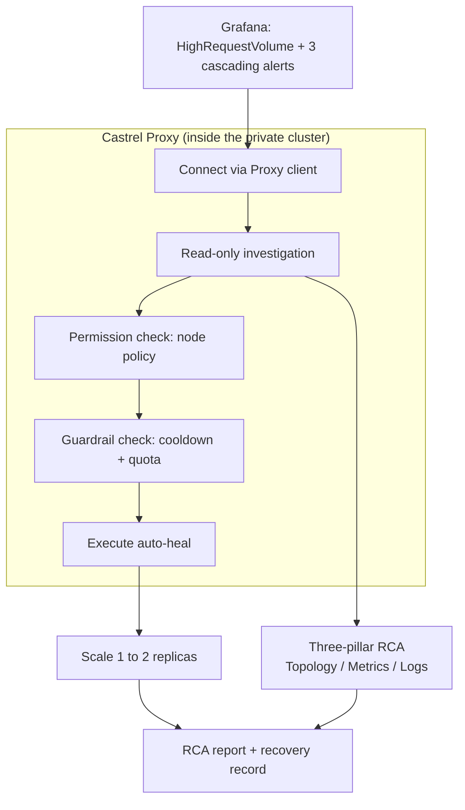

::callout{icon="i-lucide-info" color="info"}
This article follows one continuous incident from alert to fix. It shows three capabilities working together: **Castrel Proxy** connecting to a private cluster, **permission management** that decides exactly what the agent may touch, and **execution failure recovery** that safely restores a degraded service. The point is not that the agent can run commands. It is that a team can let an agent act inside production without losing control.
::

---

## The Scenario

A food-ordering microservice, `ts-train-food-service`, runs inside a private Kubernetes cluster. There is no public ingress to the cluster, no bastion the agent can log into, and the on-call engineer is asleep.

At 2 AM, Grafana fires a `HighRequestVolume` alert. Seconds later three more alerts follow: elevated latency, memory pressure, and error-rate spikes on adjacent services. Four alerts, one page, and a tired engineer who now has to figure out which one is the real problem and which three are just downstream noise.

This is the moment most incidents actually go wrong. Not because the fix is hard, but because the first thirty minutes are spent reconstructing context: opening dashboards, correlating timestamps, tracing which service failed first, and confirming it is safe to touch anything.

---

## Why the Old Way Is Slow

The manual path has a predictable shape, and every step costs time:

- **Reach the cluster.** The engineer connects through a VPN, finds the right kube-context, and hopes their access still works.
- **Separate cause from effect.** Four alerts look equally urgent. Deciding that three of them are cascading victims of one root cause requires reading metrics, logs, and traces across several services.
- **Confirm it is safe to act.** Before scaling anything, the engineer has to check whether the cluster even has the capacity, or they risk turning one broken service into a broken node.
- **Act, then document.** Only after all of that does the actual fix happen, and the write-up usually happens the next morning, if at all.

An ordinary chatbot cannot help here. It has no route into the private cluster, no live telemetry, and no safe way to run a command. It can suggest what you might do. It cannot do it.

---

## How Castrel Takes Over the Workflow

Castrel treats this as one connected task instead of a pile of separate tools. The flow below is what actually runs.

### 1. Castrel Proxy connects to the private cluster

The cluster has no public entry point, so Castrel does not try to reach in from the outside. Instead, a lightweight **Castrel Proxy** already runs inside the customer network. The agent talks to that proxy, and the proxy runs commands locally against the cluster it lives in.

In practice this means the agent can run `kubectl get`, inspect pod events, and read a file from disk, all executed *inside* the network by the proxy rather than over an exposed port. The private cluster stays private. Nothing about its topology is published to reach it.

The proxy also advertises what it can do: which MCP servers are available (for example a GitLab integration and a reasoning service) and which operational skills are installed, such as `rootcause`, `k8s-troubleshoot`, and `slo-health-check`. The agent picks the skill that matches the alert instead of improvising.

### 2. Permission management decides what the agent may touch

Connecting to the network is not the same as being allowed to do anything on it. The proxy carries a **node policy** that the organization controls. In this scenario the policy is explicit:

| Capability | Policy |
| :--- | :--- |
| **Shell commands** | Allowed, but constrained by an allowlist (e.g. read-only inspection commands like `cat`) |
| **Filesystem read** | Enabled |
| **Filesystem write / edit** | Enabled |

This is the part that makes autonomous action acceptable. The team decides in advance what the agent is permitted to run on each node. The agent operates inside that boundary rather than asking to be trusted with the whole box. A cluster owner can grant read-everywhere, execute-narrowly, and the agent still gets enough room to investigate and recover.

::callout{icon="i-lucide-shield-check" color="primary"}
The node policy turns "can the agent run commands in production?" into a controlled question. The answer is scoped, auditable, and set by the people who own the infrastructure, not by the agent.
::

### 3. A three-pillar investigation finds the real root cause

With read access through the proxy, the agent runs a hypothesis-driven investigation across the three observability pillars:

- **Topology (traces):** map the call graph to see which service is the origin and which are downstream.
- **Metrics:** correlate the alert timing with resource usage.
- **Logs:** confirm the specific failure mode.

The finding: `ts-train-food-service` was running a single replica whose memory sat at roughly 91% of its 2Gi limit while absorbing over a thousand requests in five minutes. The other three alerts were cascading victims of that one saturated pod. The alert storm collapses into a single, explainable root cause.

### 4. Execution failure recovery, gated by guardrails

Diagnosis alone would still leave a sleeping engineer with a broken service. So the `rootcause` skill goes one step further and runs a recovery action through the proxy: an auto-heal script that horizontally scales the deployment.

Crucially, the skill does not scale blindly. Before it acts, two guardrails run:

- **Cooldown.** A 180-second cooldown prevents the agent from repeatedly scaling the same service in a tight loop.
- **Quota Guard.** If the cluster has less than 10% allocatable CPU or memory left, scaling is blocked. Adding a replica to a cluster that is already full would only spread the failure.

In this scenario the cluster had about 97% CPU headroom, so the Quota Guard passed. The agent scaled the deployment from 1 to 2 replicas, and the service returned to a healthy state in seconds.

---

## The Result

By the time the on-call engineer would normally have finished connecting to the VPN, the incident was already handled:

- The four-alert storm was reduced to one identified root cause.
- The failing service was scaled from 1 to 2 replicas and recovered.
- A root-cause report and a recovery record were written, so the morning review starts from a finished investigation instead of a blank page.

The engineer wakes up to a resolved incident with a full explanation, not a 2 AM page.

---

## Why This Matters

Each of the three pieces is useful alone. Together they change what an agent is allowed to be.

- **Castrel Proxy** removes the "the agent can't reach our environment" objection. Private infrastructure stays private, and the agent still works inside it.
- **Permission management** removes the "we can't let an agent run commands in production" objection. The node policy scopes exactly what is allowed.
- **Execution failure recovery with guardrails** removes the "diagnosis without action isn't worth much" objection. The agent fixes the problem, but only within limits the team set.

The combination is what lets a team move from "the agent tells us what to do" to "the agent safely does it, and we can see exactly what it did."

---

## Closing

This same shape applies well beyond a single food-ordering service. Any scenario where a fault is detectable from telemetry and recoverable with a bounded action fits the pattern: restart a stuck worker, scale a saturated service, roll back a bad config, clear a full queue. Castrel Proxy provides the reach, the node policy provides the control, and guardrailed recovery provides the safety. The result is not just faster incident response. It is incident response you can hand to an agent without handing over the keys.
