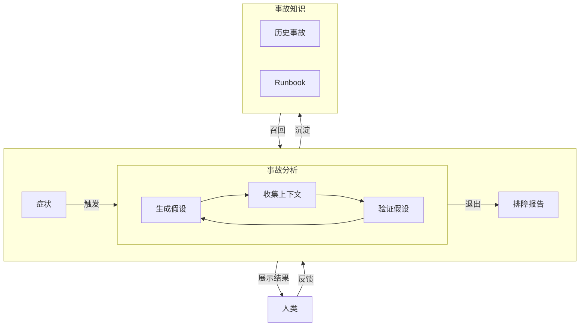
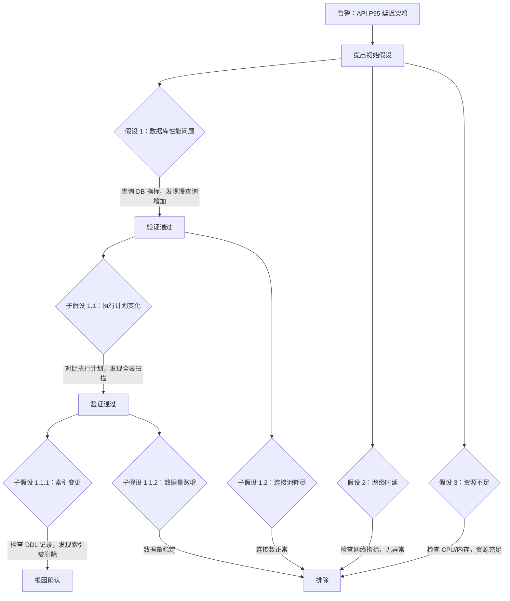

::callout{icon="i-lucide-info" color="info"}
本文介绍 Castrel 事故排障 Agent 的核心设计理念，包含：**假设驱动调查**、**人机协作**、**业务知识沉淀**，帮助团队从“发现问题”到“定位根因或快速升级”形成高效闭环。
::
---

下图展示了 Castrel 事故排障 Agent 的核心工作流。



---

## 1. 可观测性上下文


AI 排障效果很大程度取决于它能够访问到的上下文数据。完整的可观测性上下文应包含以下维度。

### 三类核心可观测性数据

| 数据类型 | 作用 | 常见来源 |
| :--- | :--- | :--- |
| **Metrics** | 发现异常、量化问题严重程度 | Prometheus、Zabbix、CloudWatch |
| **Logs** | 定位具体错误、获得上下文细节 | Elasticsearch、Loki、Splunk |
| **Traces** | 追踪请求路径、定位慢调用位置 | Jaeger、Tempo、SkyWalking |

仅依赖任意单一数据类型都很难高效排障。Metrics 告诉你“出了问题”，Logs 告诉你“具体是什么错”，Traces 告诉你“链路上哪里出了问题”。

### 调用关系与部署关系

除了三类可观测性数据，AI 还需要理解系统的**拓扑关系**：

- **调用关系**：服务之间的依赖关系（通常由 APM 提供）
- **部署关系**：服务运行在哪些主机/容器上（可来自 APM、Zabbix 或 Kubernetes）

有了调用关系，AI 才能判断故障是从上游传导而来，还是当前服务自身问题；有了部署关系，AI 才能关联基础设施层面的异常（例如主机 CPU 飙升、磁盘写满）。

### 实践建议

- **优先接入 APM**：APM 通常可同时提供 Traces、调用关系和部署关系，是性价比最高的数据源
- **补齐基础设施监控**：来自 Zabbix、Node Exporter 等的主机级指标是关键补充
- **Kubernetes 元数据**：如果使用 K8s，其 Events、Pod 状态、Deployment 变更记录都属于关键上下文

::callout{icon="i-lucide-trophy" color="primary"}
数据越完整，AI 分析越准确。缺少任何一种数据类型都会显著降低排障效率。
::

---

## 2. 假设驱动

### 核心思想：像人类 SRE 一样思考

传统 AI 分析方法通常是先收集大量遥测数据，再让模型一次性总结。这种“摘要引擎”模式有明显局限：数据量越大，模型越容易被无关信号干扰，输出质量反而下降。

更高效的方式是让 AI **像人类 SRE 一样工作**：

1. **提出假设**：根据告警和初步数据生成可能根因假设
2. **验证假设**：针对每条假设查询特定遥测数据进行验证
3. **递归下钻**：当某条假设被验证后，继续生成更深一层子假设
4. **及时剪枝**：当某条假设被证伪时，立刻剪掉该分支，聚焦其他方向

### 假设分支策略



### 与传统方法对比

| 维度 | 传统摘要模式 | 假设驱动模式 |
| :--- | :--- | :--- |
| **数据处理方式** | 一次性收集全部数据 | 按需查询特定数据 |
| **噪音干扰** | 易被无关异常带偏 | 聚焦因果链路 |
| **调查深度** | 停留在表层症状 | 递归下钻到根因 |
| **可解释性** | 结论难以追溯 | 具备完整假设验证链 |

::callout{icon="i-lucide-trophy" color="primary"}
假设驱动调查让 AI 的分析过程透明、可追溯，每个结论都有数据支撑。
::

---

## 3. 人机协作

假设驱动调查要发挥最大效果，需要人和 AI 双向协作。传统 AI 分析是单向的：AI 给结论，用户接受或拒绝。更高效的模式是**双向协作**：

### AI 的角色

- **掌握通用知识**：理解系统架构、故障模式和排障方法论
- **快速扫描数据**：在海量 Metrics、Logs、Traces 中快速定位异常
- **并行验证假设**：同时验证多个可能的根因方向

### 人的角色

- **业务上下文**：告诉 AI 业务逻辑，比如“晚上 9 点 CPU 高是活动流量，属正常现象”
- **经验输入**：提供历史经验，比如“我们网络一直不稳，上次是 DNS 抖动”

### 典型协作场景

```
AI:   （完成初步假设分析）
      "已验证 3 条假设：
       ✓ 数据库慢查询增加 - 与告警时间匹配
       ✗ 网络时延 - 无异常
       ✗ 资源不足 - CPU/内存充足

       正在沿数据库方向继续深挖..."

User: （看到假设列表，想起上周变更）
      "DBA 上周改过订单表索引"

AI:   （新增假设并验证）
      "新增假设：索引变更导致执行计划变化
       → 检查 DDL 变更记录：发现上周四删除了订单表索引
       → 对比执行计划：删除前走索引扫描，删除后变为全表扫描
       → 时间关联：索引删除时间与慢查询开始时间一致
       ✓ 假设成立，确认根因"

User: （验证成功）
      "确认了！需要恢复索引。"
```

::callout{icon="i-lucide-trophy" color="primary"}
AI 擅长处理海量数据和通用知识，人擅长提供业务上下文和历史经验。双向协作能让排障效率远超纯 AI 或纯人工。
::

---

## 4. 退出策略

AI 并不总能直接找到根因，尤其在数据接入不完整时。但这并不意味着 AI 分析没有价值。

### 多组件问题的深度排查

复杂事故的根因可能横跨多个系统，或需要多层推理才能找到。假设驱动允许 AI 递归下钻，直到搜索空间被穷尽。

**案例：Pod 频繁重启（CrashLoopBackOff）**

```
告警：Kubernetes Pod 进入 CrashLoopBackOff 状态

第一层分析：
  → 假设：内存不足触发 OOM Kill
  → 验证：检查 Pod 事件，确认 OOMKilled
  → 结论：假设成立，但这只是表层原因

第二层分析（递归深挖）：
  → 假设：请求负载异常增大导致内存突增
  → 验证：检查入流量，发现 Kafka 消息体异常变大
  → 结论：假设成立，继续下钻

第三层分析：
  → 假设：上游系统发送了异常大消息
  → 验证：追查消息来源，发现某批次数据包含损坏的大文件
  → 结论：根因确认 - 上游数据异常导致消息尺寸溢出
```

早期版本 AI 可能在第一层就停止，只给出“Pod OOM”结论。但这对工程师帮助有限，因为告警本身已经告诉了这件事。真正有价值的是找到**为什么会 OOM**。

### 排除干扰项的价值

即使 AI 缺少足够数据、无法直接锁定根因，它通常仍能：

1. **指出大致排查方向**：比如“问题更可能在数据库层”或“与最近部署变更相关”
2. **排除无关干扰项**：比如确认网络连通正常、资源利用率充足、缓存命中率无异常

这种“排除法”本身就能节省大量时间。传统排障里，工程师往往要先逐项检查网络、资源、缓存等基础设施，再排除这些可能性。AI 能在几分钟内完成这一步，让用户直接聚焦最可能的问题方向。

### 上下文交接

当 AI 因数据不足无法继续深挖时，它可以向用户输出结构化上下文交接：

```
📋 排查进度交接

⏱️ 分析耗时：5 分钟 | 已扫描组件：12 个

✅ 已排除：
• 网络连通正常（Ping <1ms，无丢包）
• K8s 资源充足（CPU <60%，Memory <70%）
• 缓存命中率正常（Redis 99.2%）

🎯 重点方向：
• 问题集中在 order-service → mysql-cluster 链路
• 数据库性能相关问题概率较高

⚠️ 需人工确认（缺失数据源）：
• 数据库慢查询日志（未接入）
• 最近 Schema 变更记录（未接入）
```

::callout{icon="i-lucide-trophy" color="primary"}
前期扫描结果不会浪费。即使 AI 不能给出最终答案，用户也能从更小的排查范围起步，而不是从零开始。
::

---

## 5. 知识沉淀


如果没有 SOP 或 Runbook，AI 首次遇到某类问题时可能需要大量探索。但这些探索结果不应被浪费。

### 因果验证的复杂性

假设驱动调查的核心是**验证因果关系**，即判断某个异常是否真的导致了当前告警。但因果验证远比看起来复杂：

| 验证维度 | 说明 | 挑战 |
| :--- | :--- | :--- |
| **时间相关性** | 异常出现时间是否与告警时间匹配 | 分布式系统中可能存在时间戳偏移 |
| **传播路径** | 异常是否位于告警对象的上下游链路 | 需要完整调用拓扑图 |
| **影响范围** | 异常影响的资源是否与告警相关 | 需要理解资源之间依赖关系 |
| **业务语义** | 该异常在业务层面是否合理 | 需要深度理解业务逻辑 |

其中最后一项“业务语义”尤其依赖**对客户业务的深度理解**。例如：

- 订单服务延迟升高，AI 发现数据库有慢查询。但这个慢查询究竟是“每天零点跑、与线上业务无关的报表任务”，还是核心下单查询？只有懂业务的人才能判断。
- 某服务错误率上升，AI 发现最近有代码部署。但这个部署是“新功能灰度（预期会有少量错误）”，还是意外 bug？这需要结合发布计划判断。

这类业务知识无法直接从遥测数据里获得，必须通过知识沉淀逐步积累。

### 从排障过程沉淀知识

当一次事故调查结束后，AI 可将过程总结为知识条目：

- **问题特征**：本次调查由哪些告警/症状组合触发
- **调查路径**：尝试了哪些方向，最终定位到什么根因
- **解决方案**：如何修复、需要注意什么

### 绑定到特定告警与资源

这些知识可绑定到具体告警类型或资源。当下次遇到相似问题时：

1. AI 自动召回相关知识
2. 参考上次调查路径，快速确认是否同类问题
3. 如果症状一致，直接给出修复建议；即便不一致，也能先排除该方向

### 示例场景

```
第一次：
• 告警：order-service P95 延迟上升
• 调查过程：查网络 → 查资源 → 查数据库 → 发现索引问题
• 沉淀知识：绑定到 order-service + 延迟类告警

第二次：
• 同类告警再次触发
• AI 自动关联知识："上次相似问题由索引导致，是否优先检查数据库？"
• 用户确认后，直接跳过网络和资源排查，进入数据库检查
• 调查耗时从 30 分钟降到 5 分钟
```

::callout{icon="i-lucide-trophy" color="primary"}
因果验证的准确性取决于对业务的深度理解。通过知识沉淀，团队经验不再只存在于个人脑中，而是成为 AI 做因果判断的重要依据。
::

---

## 6. 总结

| 能力 | 说明 |
| :--- | :--- |
| **可观测性上下文** | 集成 Metrics、Logs、Traces 与调用拓扑 |
| **假设驱动** | 提假设 → 验证 → 递归下钻，而非简单摘要 |
| **人机协作** | AI 扫描数据，人类提供业务上下文和历史经验 |
| **退出策略** | 即便无法锁定根因，也能排除干扰项并输出关键结论 |
| **知识沉淀** | 沉淀业务知识，提升后续排障准确性与效率 |

Castrel 事故排障 Agent 的目标不是“AI 取代人”，而是让人机协作效率显著超过纯 AI 或纯人工。
