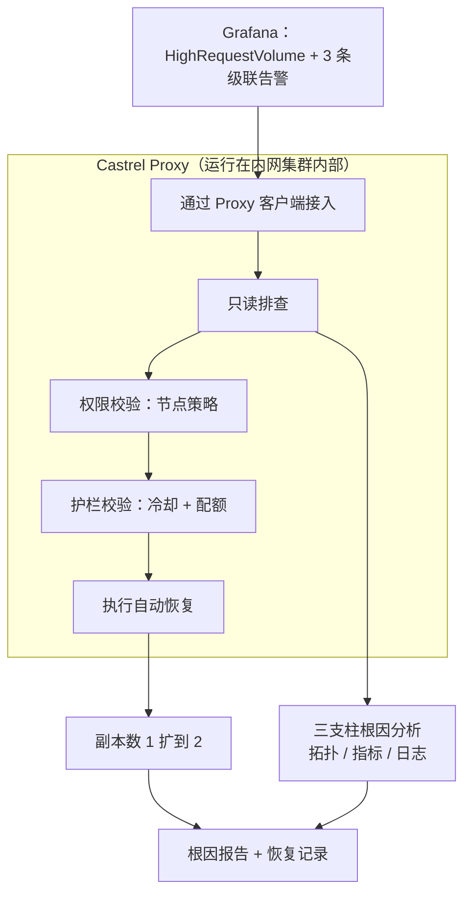

::callout{icon="i-lucide-info" color="info"}
本文跟随一次完整的事故，从告警一路讲到修复。它展示了三个能力如何协同工作：**Castrel Proxy** 接入内网集群、**权限管理**决定 Agent 到底能动什么、以及**执行故障恢复**安全地把降级服务拉回健康。重点不是"Agent 能执行命令"，而是团队可以在不失控的前提下，让 Agent 真正在生产环境里动手。
::

---

## 场景

一个负责点餐的微服务 `ts-train-food-service` 运行在内网 Kubernetes 集群里。集群没有对公网暴露的入口，Agent 没有可登录的堡垒机，而值班工程师正在睡觉。

凌晨两点，Grafana 触发 `HighRequestVolume` 告警。几秒钟后又来了三条：延迟升高、内存压力、相邻服务错误率飙升。四条告警、一次电话，一个刚被叫醒的工程师，现在得先搞清楚哪一条是真问题，哪三条只是下游噪音。

大多数事故其实是在这一刻开始失控的。不是因为修复本身有多难，而是因为前三十分钟都花在重建上下文上：打开面板、对齐时间戳、追查哪个服务先挂、确认动手是否安全。

---

## 为什么旧方式慢

人工路径的形状是可预测的，而每一步都在消耗时间：

- **接入集群。** 工程师连上 VPN，找到正确的 kube-context，还得祈祷自己的权限还没过期。
- **区分因果。** 四条告警看起来同样紧急。要判断其中三条只是某个根因的级联受害者，得跨多个服务翻 Metrics、Logs 和 Traces。
- **确认动手安全。** 在扩容任何东西之前，工程师得先确认集群还有没有容量，否则可能把一个坏掉的服务变成一个坏掉的节点。
- **先动手，再补文档。** 只有在这一切之后，真正的修复才发生，而复盘记录通常要等到第二天早上——如果还记得写的话。

普通聊天机器人在这里帮不上忙。它没有进入内网集群的通道，没有实时遥测，也没有安全执行命令的方式。它能建议你"可以怎么做"，但它做不了。

---

## Castrel 如何接管这段工作

Castrel 把这件事当成一个连续任务来处理，而不是一堆彼此割裂的工具。下面这张图就是实际运行的流程。

### 1. Castrel Proxy 接入内网集群

集群没有公网入口，所以 Castrel 不会尝试从外部"打进去"。取而代之的是，一个轻量的 **Castrel Proxy** 早已运行在客户内网里。Agent 与这个 Proxy 通信，而 Proxy 在它所在的集群里本地执行命令。

具体来说，Agent 可以执行 `kubectl get`、查看 Pod 事件、读取磁盘上的文件——这些都由 Proxy 在**内网内部**执行，而不是通过某个暴露的端口。内网集群依然是内网。不需要为了让 Agent 够得着，就把集群拓扑公开出去。

Proxy 还会声明自己能做什么：有哪些 MCP 服务可用（例如 GitLab 集成和推理服务），以及安装了哪些运维 Skill，比如 `rootcause`、`k8s-troubleshoot`、`slo-health-check`。Agent 会挑选与告警匹配的 Skill，而不是临场发挥。

### 2. 权限管理决定 Agent 能动什么

接入内网，不等于可以在内网上为所欲为。Proxy 携带一份由组织掌控的**节点策略（node policy）**。在这个场景里，策略是明确的：

| 能力 | 策略 |
| :--- | :--- |
| **Shell 命令** | 允许，但受允许清单约束（例如只放行 `cat` 这类只读排查命令） |
| **文件系统读取** | 开启 |
| **文件系统写入 / 编辑** | 开启 |

这正是让自主执行变得可接受的关键。团队提前决定 Agent 在每个节点上被允许运行什么，Agent 在这个边界内工作，而不是要求你把整台机器的信任交给它。集群负责人可以授予"到处可读、执行受限"，而 Agent 依然有足够空间去排查和恢复。

::callout{icon="i-lucide-shield-check" color="primary"}
节点策略把"能不能让 Agent 在生产环境执行命令"变成一个受控的问题。答案是有范围的、可审计的，而且由拥有基础设施的人来设定，而不是由 Agent 自己决定。
::

### 3. 三支柱排查找到真正的根因

拿到通过 Proxy 的只读权限后，Agent 沿着三类可观测性数据做假设驱动的排查：

- **拓扑（Traces）：** 画出调用链，看清哪个服务是源头、哪些是下游。
- **指标（Metrics）：** 把告警时间与资源使用对齐。
- **日志（Logs）：** 确认具体的故障形态。

结论是：`ts-train-food-service` 当时只跑着 1 个副本，内存已经处在 2Gi 上限的约 91%，同时在五分钟内承接了一千多次请求。另外三条告警都是这个饱和 Pod 的级联受害者。告警风暴由此收敛成一个可解释的单一根因。

### 4. 带护栏的执行故障恢复

只做诊断，仍然会把一个坏掉的服务留给还在睡觉的工程师。所以 `rootcause` Skill 更进一步，通过 Proxy 执行一次恢复动作：一个把 Deployment 横向扩容的自动恢复脚本。

关键在于，这个 Skill 不会盲目扩容。在动手之前，会先跑两道护栏：

- **冷却时间。** 180 秒的冷却，防止 Agent 在短时间内对同一个服务反复扩容。
- **配额护栏（Quota Guard）。** 如果集群可分配的 CPU 或内存已不足 10%，扩容会被拦截。往一个本就满载的集群里再塞一个副本，只会让故障蔓延。

在这个场景里，集群还有约 97% 的 CPU 余量，配额护栏通过。Agent 把 Deployment 从 1 个副本扩到 2 个，服务在几秒内回到健康状态。

---

## 结果

在值班工程师正常情况下刚连完 VPN 的时候，这次事故其实已经处理完了：

- 四条告警的风暴，收敛成一个已确认的根因。
- 故障服务从 1 个副本扩到 2 个，完成恢复。
- 一份根因报告和一条恢复记录已经写好，早上的复盘从一个"已完成的排查"开始，而不是一张白纸。

工程师醒来时面对的是一个已解决的事故和一份完整解释，而不是凌晨两点的电话。

---

## 为什么这件事重要

这三块能力各自单看都有用。合在一起，它们改变了 Agent 被允许成为什么。

- **Castrel Proxy** 消除了"Agent 够不着我们环境"这个顾虑。私有基础设施依然私有，Agent 却能在里面工作。
- **权限管理**消除了"我们不能让 Agent 在生产环境执行命令"这个顾虑。节点策略精确地圈定了什么被允许。
- **带护栏的执行故障恢复**消除了"只诊断不动手意义不大"这个顾虑。Agent 会真正修复问题，但只在团队设定的边界内。

这套组合，正是让团队从"Agent 告诉我们该怎么做"迈向"Agent 安全地把它做了，而且我们能清楚看到它做了什么"的关键。

---

## 结语

同样的形态远不止适用于一个点餐服务。任何"故障能从遥测里被发现、又能用一个有边界的动作恢复"的场景都符合这个模式：重启卡死的 worker、扩容饱和的服务、回滚坏配置、清空写满的队列。Castrel Proxy 提供触达能力，节点策略提供控制能力，带护栏的恢复提供安全边界。最终得到的不只是更快的事故响应，而是一种你可以放心交给 Agent、又无需把钥匙一并交出去的事故响应。
