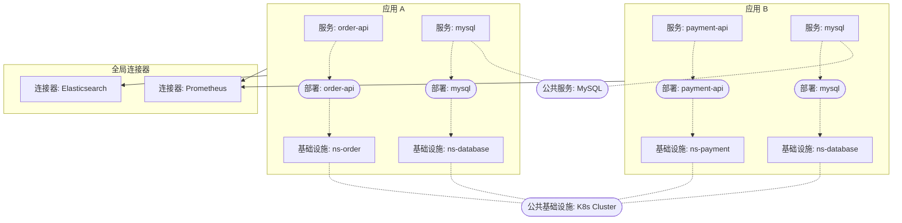

# 应用

Applications 是 Castrel 中用于组织和隔离运维上下文的基础命名空间单元。如果你在同一个 Castrel 租户里维护多个互不相关的业务系统，Applications 可以帮助你在逻辑上把它们分开。

## 什么是 Application？

Application 是一个容器，用来把相关运维资源组织在一起：

- **服务**：构成系统的微服务、API 和组件
- **基础设施**：服务器、数据库、云资源等基础设施
- **知识**：与该应用相关的运维文档、runbook 和上下文信息

## 架构概览

## 核心概念

**服务与基础设施**

服务和基础设施都属于某个 Application，它们通过 **服务实例** 建立联系：

- 一个 **服务** 会实例化为一个 **服务实例**
- 一个 **服务实例** 会部署在某个 **基础设施** 上

这个模型同时描述了“应用做什么”（服务）以及“它运行在哪里”（基础设施）之间的关系。

**公共服务与公共基础设施**

在真实环境里，多个 Application 往往会共享一些通用组件：

- **公共服务**：例如 MySQL 或 Redis 这类共享服务定义。当 Application A 和 Application B 都使用 MySQL 时，每个 Application 都会保留自己的 `mysql` 服务条目，但它们都引用同一个公共服务定义。这样每个团队既能维护本应用特定的知识，又能共享通用文档。

- **公共基础设施**：例如 Kubernetes 集群或数据库服务器这类共享基础设施。每个 Application 仍然会维护自己的基础设施条目（例如某些 Pod 或虚拟机），但这些条目会引用同一个公共基础设施。这样既保留应用级关系和上下文，也能表达共享资源。

::callout{icon="i-lucide-info" color="info"}
即使引用的是公共资源，每个 Application 仍然会维护自己的一份服务/基础设施条目。这能在共享知识的同时，保证上下文隔离。
::

**连接器（全局）**

连接器是 **全局资源**，代表 Prometheus、Elasticsearch、Grafana Loki 等数据源，不隶属于任何具体 Application。

Application 会记录哪些连接器里包含自己的可观测性数据。这个关联关系会告诉 Castrel：*"当调查这个 Application 时，应从这些连接器中查询相关数据。"*

## 为什么要使用 Applications？

**上下文隔离**

在事故调查或告警分诊时，Castrel 会以 Application 边界限定分析范围：

- 查询只访问相关的数据源
- 知识检索只聚焦适用的文档
- 告警关联只考虑相关服务

**支持多团队协作**

不同团队可以在各自的 Application 内独立工作：

- 团队 A 在 `app-ecommerce` 中维护电商平台
- 团队 B 在 `app-data-platform` 中维护数据平台
- 两个团队共用同一个 Castrel 租户而互不干扰

## 开始使用

1. 在 Castrel 控制台中创建一个 Application
2. 添加属于该应用的服务
3. 添加服务运行所在的基础设施
4. 将 Application 关联到承载其可观测性数据的连接器
5. 上传或生成运维知识，补充上下文

完成配置后，Castrel 就会自动把相关操作限定在对应的 Application 上下文中。
