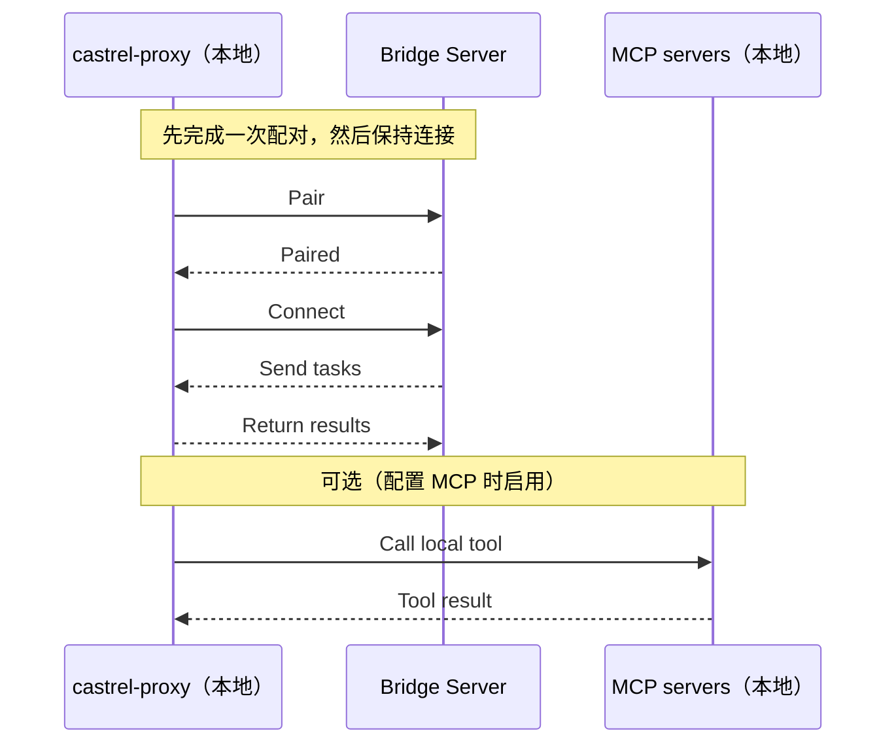

Castrel Proxy 是一个轻量级的 **本地 Bridge 客户端**。它会通过 WebSocket 连接到远端 Castrel Bridge Server，接收来自服务器的指令，在你的机器上执行它们，再把结果返回给服务器。

::callout{icon="i-simple-icons-github" color="gray"}
**开源**：Castrel Proxy 完全开源。你可以在 GitHub 上查看代码、提交问题或参与贡献：[castrel-ai/open-castrel-proxy](https://github.com/castrel-ai/castrel-proxy)
::

它提供五项核心能力：

- **命令执行**：运行 shell 命令（受工作区策略与本地白名单共同约束）
- **文档操作**：读取 / 写入 / 编辑文件（带路径和大小约束）
- **MCP 集成**：连接本地配置好的 MCP 服务，并把可用工具同步到服务器
- **HTTP 代理访问**：通过 Proxy 转发对内网 HTTP 端点的请求
- **交互式终端会话**：支持长时命令会话与增量输出

## 工作原理

Castrel Proxy 会先与服务器配对，保持长连接，在本地执行任务并返回结果。如果你配置了 MCP，它还可以在需要时调用本地 MCP 工具。



## 快速开始

1. 安装（推荐）

```bash
curl -fsSL https://castrel.ai/castrel-proxy/install.sh | bash
```

安装脚本会从 `/castrel-proxy/packages/*` 下载对应平台二进制，校验 `.sha256` 后安装 `castrel-proxy`。要求 `Python >= 3.10`。

2. 配对

```bash
castrel-proxy pair <verification_code> <server_url>
```

配对后会保存 `~/.castrel/config.yaml`，并尝试读取 `~/.castrel/mcp.json` 同步 MCP 能力（未配置则跳过）。

3. 启动

```bash
# 前台模式（默认）
castrel-proxy start

# 后台守护进程模式（Unix/macOS）
castrel-proxy start --daemon
```

4. 检查状态与日志

```bash
castrel-proxy status
castrel-proxy logs
castrel-proxy logs -f
```

5. 通过 Proxy 代理内网 Connector（例如内网 Prometheus）

- 在 Castrel 中配置对应 Connector（目标地址是内网地址，如 `http://prometheus.internal:9090`）
- 把该 Connector 绑定到已配对的 Bridge Node（Proxy 节点）
- 在会话里使用该 Connector 查询时，请求会通过 Proxy 的 `http_proxy_call` 在节点本地转发到内网端点

6. 通过 Connector/Bridge Node 执行本地命令（例如 `free` / `top`）

- 在会话中选择对应节点后，直接让 AI 执行本机命令
- 推荐用非交互形式，例如：

```bash
free -h
top -b -n 1
```

这类请求会走 `local_tool_call`，并以单个 `command_line` 字符串在节点本地执行。

7. 停止 / 解除配对

```bash
castrel-proxy stop
castrel-proxy unpair
```

## 配置与文件位置

默认情况下，Castrel Proxy 使用 `~/.castrel/`：

- **Bridge 配置**：`~/.castrel/config.yaml`
  - `server_url`：服务器地址
  - `verification_code`：配对码
  - `client_id`：由主机名 + MAC 推导出的稳定 ID（16 位十六进制）
  - `workspace_id`：从 verification code 中提取出的工作区 ID
  - `paired_at`：配对时间
- **命令白名单**：`~/.castrel/whitelist.conf`
  - 每行一个允许执行的基础命令（例如 `git`、`kubectl`）
- **MCP 配置（可选）**：`~/.castrel/mcp.json`
- **守护进程文件**（后台模式）：
  - PID：`~/.castrel/castrel-proxy.pid`
  - 日志：`~/.castrel/castrel-proxy.log`
- **按会话分隔的日志**（服务器下发任务时写入）：
  - `~/.castrel/<session_id>/terminal.log`

## 核心能力（当前实现）

### 1）命令执行（`command_line` + 策略校验）

当服务器下发 `local_tool_call` 时，Castrel Proxy 会在本地执行单个 `command_line` 字符串，并返回 `stdout`、`stderr`、`exit_code` 和耗时信息。

安全校验顺序如下（采用产品中的策略文案）：

- **全部拒绝（`deny_all`）**：拒绝所有 Bash 命令执行
- **使用白名单（`allowlist`）**：只允许运行策略里允许的命令
- **透传（`passthrough`）**：使用节点本地 `~/.castrel/whitelist.conf`

如果服务端未下发策略，默认按 **透传** 处理。

复合命令（如 `ls && cat file | grep foo`）会被拆解后逐条校验。

### 2）文档操作（读 / 写 / 编辑）

Castrel Proxy 支持：

- 读取文件
- 以覆盖方式写入文件
- 使用 `replace` / `append` / `prepend` 编辑文件

约束如下：

- **路径必须是绝对路径**
- **读取大小上限为 10MB**
- **以你的系统权限运行**（不会做提权）
- **可被工作区策略关闭**（`read_enabled` / `write_enabled` / `edit_enabled`）

### 3）MCP（Model Context Protocol）集成

如果你希望把本地 MCP 工具暴露给服务器，可以配置 `~/.castrel/mcp.json`，然后使用：

```bash
castrel-proxy mcp-list
castrel-proxy mcp-sync
```

当前支持的传输方式包括：

- `stdio`（需要 `command` + `args`，可选 `env`）
- `http`（需要 `url`）
- `sse`（需要 `url`）

### 4）HTTP 代理内网访问

Castrel Proxy 支持处理服务端下发的 `http_proxy_call`，并把目标端点的状态码与响应体回传给 Castrel。这个能力主要用于访问内网可观测性端点（例如内网 Prometheus），而无需对公网暴露。

HTTP 转发同样受工作区策略控制（`http.enabled`，以及可选的 `http.allow_hosts`）。

### 5）交互式本地执行

Castrel Proxy 支持 `local_interactive_call` 的 start/write/read/stop 模式，适用于需要持续交互的命令执行场景。

## 什么时候适合使用 Castrel Proxy

- 你的 Connector 在内网，SaaS 侧无法直接访问（通过 Proxy 转发内网 HTTP 请求）
- 你希望在调查时直接执行节点本地命令（例如 `free -h`、`top -b -n 1`、`kubectl`）
- 你需要让 AI 读取/写入/编辑本地文件来辅助排障
- 你要把本地 MCP 工具能力同步给 Castrel 使用
- 你需要基于策略做精细化控制（全部拒绝 / 使用白名单 / 透传）

## 常见问题

### Castrel Proxy 会在我的机器上开放入站端口吗？

不会。它只会主动向服务器建立一条出站 WebSocket 连接，不需要任何入站端口。

### 如何允许额外的命令？

把基础命令名写入 `~/.castrel/whitelist.conf`（每行一个）。例如要允许 `kubectl get pods`，只需要加入 `kubectl`。

### 为什么读取文件失败？

常见原因包括：

- 路径不是绝对路径
- 文件超过 10MB
- 你的用户没有读取权限

### 如何卸载？

先停止代理，再卸载，并删除本地配置和日志：

::code-group

```bash [Script]
castrel-proxy stop
rm -f "$(command -v castrel-proxy)"
rm -rf ~/.castrel
```

```bash [Pip]
castrel-proxy stop
pip uninstall castrel-proxy
rm -rf ~/.castrel
```

::
