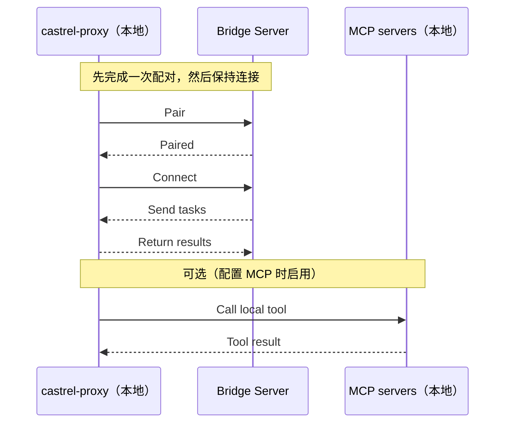

Castrel Proxy 是一个轻量级的 **本地 Bridge 客户端**。它会通过 WebSocket 连接到远端 Castrel Bridge Server，接收来自服务器的指令，在你的机器上执行它们，再把结果返回给服务器。

::callout{icon="i-simple-icons-github" color="gray"}
**开源**：Castrel Proxy 完全开源。你可以在 GitHub 上查看代码、提交问题或参与贡献：[castrel-ai/open-castrel-proxy](https://github.com/castrel-ai/castrel-proxy)
::

它提供三项核心能力：

- **命令执行**：运行 shell 命令（严格受白名单控制）
- **文档操作**：读取 / 写入 / 编辑文件（带路径和大小约束）
- **MCP 集成**：连接本地配置好的 MCP 服务，并把可用工具同步到服务器

## 工作原理

Castrel Proxy 会先与服务器配对，保持长连接，在本地执行任务并返回结果。如果你配置了 MCP，它还可以在需要时调用本地 MCP 工具。



## 快速开始

### 安装

::code-group

```bash [Script]
curl -fsSL https://castrel.ai/install | bash
```

```bash [Pip]
pip install castrel-proxy
```

::

要求：Python >= 3.10

### 配对

从你的 Castrel / Bridge Server 管理界面获取 **verification code** 和 **server URL**，然后执行：

```bash
castrel-proxy pair <verification_code> <server_url>
```

配对完成后，Castrel Proxy 会：

- 把配对配置保存到 `~/.castrel/config.yaml`
- 在 `~/.castrel/whitelist.conf` 中初始化命令白名单
- 尝试读取 `~/.castrel/mcp.json` 并同步一次 MCP 工具信息（如果未配置则跳过）

### 启动

```bash
# 后台守护进程模式（默认，Unix/macOS）
castrel-proxy start

# 前台模式（所有平台）
castrel-proxy start --foreground
```

### 状态与日志

```bash
castrel-proxy status
castrel-proxy logs
castrel-proxy logs -f
```

### 停止 / 解除配对

```bash
castrel-proxy stop
castrel-proxy unpair
```

## 配置与文件位置

默认情况下，Castrel Proxy 使用 `~/.castrel/`：

- **Bridge 配置**：`~/.castrel/config.yaml`
  - `server_url`：服务器地址
  - `verification_code`：配对码
  - `client_id`：由主机名 + MAC 推导出的稳定 ID（16 位十六进制）
  - `workspace_id`：从 verification code 中提取出的工作区 ID
  - `paired_at`：配对时间
- **命令白名单**：`~/.castrel/whitelist.conf`
  - 每行一个允许执行的基础命令（例如 `git`、`kubectl`）
- **MCP 配置（可选）**：`~/.castrel/mcp.json`
- **守护进程文件**（后台模式）：
  - PID：`~/.castrel/castrel-proxy.pid`
  - 日志：`~/.castrel/castrel-proxy.log`
- **按会话分隔的日志**（服务器下发任务时写入）：
  - `~/.castrel/<session_id>/terminal.log`

## 核心能力（当前实现）

### 1）命令执行（强制白名单）

当服务器下发命令时，Castrel Proxy 会在本地执行，并返回 `stdout`、`stderr`、`exit_code` 和耗时信息。

安全行为如下：

- **必须命中白名单**：只有基础命令存在于 `~/.castrel/whitelist.conf` 中时才能执行
- **会解析复合命令**：例如 `ls && cat file | grep foo` 会被拆开，每个子命令都必须被允许
- **拒绝信息清晰**：返回结果会指出哪些命令被阻止，以及白名单文件路径

### 2）文档操作（读 / 写 / 编辑）

Castrel Proxy 支持：

- 读取文件
- 以覆盖方式写入文件
- 使用 `replace` / `append` / `prepend` 编辑文件

约束如下：

- **路径必须是绝对路径**
- **读取大小上限为 10MB**
- **以你的系统权限运行**（不会做提权）

### 3）MCP（Model Context Protocol）集成

如果你希望把本地 MCP 工具暴露给服务器，可以配置 `~/.castrel/mcp.json`，然后使用：

```bash
castrel-proxy mcp-list
castrel-proxy mcp-sync
```

当前支持的传输方式包括：

- `stdio`（需要 `command` + `args`，可选 `env`）
- `http`（需要 `url`）
- `sse`（需要 `url`）

## 什么时候适合使用 Castrel Proxy

- 本地排障：把本地命令输出和本地文件引入远程调查流程
- 受控远程协作：把执行范围严格限制在你批准的命令白名单之内
- 连接本地 MCP 工具：例如 filesystem/github/internal HTTP 等 MCP 服务

## 常见问题

### Castrel Proxy 会在我的机器上开放入站端口吗？

不会。它只会主动向服务器建立一条出站 WebSocket 连接，不需要任何入站端口。

### 如何允许额外的命令？

把基础命令名写入 `~/.castrel/whitelist.conf`（每行一个）。例如要允许 `kubectl get pods`，只需要加入 `kubectl`。

### 为什么读取文件失败？

常见原因包括：

- 路径不是绝对路径
- 文件超过 10MB
- 你的用户没有读取权限

### 如何卸载？

先停止代理，再卸载，并删除本地配置和日志：

::code-group

```bash [Script]
castrel-proxy stop
rm -f castrel-proxy
rm -rf ~/.castrel
```

```bash [Pip]
castrel-proxy stop
pip uninstall castrel-proxy
rm -rf ~/.castrel
```

::
